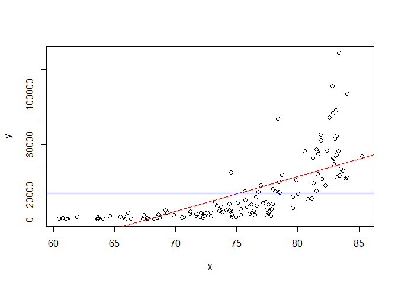

Praktikum 3 Anreg
================
Muhammad Khayruhanif M0401241058
2026-02-10

- [Data](#data)
- [Model](#model)
- [Penguraian Keragaman](#penguraian-keragaman)
- [Keragaman Dugaan Parameter](#keragaman-dugaan-parameter)
  - [Dugaan Parameter $\beta_0$](#dugaan-parameter-beta_0)
  - [Dugaan Parameter $\beta_1$](#dugaan-parameter-beta_1)
- [Selang Kepercayaan Parameter](#selang-kepercayaan-parameter)
- [Selang Kepercayaan](#selang-kepercayaan)
  - [Bagi Nilai Rataan/Nilai Harapan
    Amatan](#bagi-nilai-rataannilai-harapan-amatan)
  - [Bagi Individu amatan](#bagi-individu-amatan)

# Data

``` r
library(readxl)
```

    ## Warning: package 'readxl' was built under R version 4.5.2

``` r
dt <- read.csv2("C:\\Users\\ASUS\\Downloads\\Data Analisis Regresi (GDP 2023).csv")
head(dt)
```

    ##   No.   Country      GCF   LFPR       LE     Trade  Inflation        FDI
    ## 1   1   Albania 23.43929 63.882 79.60200  82.35249   4.758346 1.11861572
    ## 2   2   Algeria 37.61688 41.507 76.26100  43.73980   9.322174 0.06678782
    ## 3   3    Angola 12.30763 74.892 64.61700  53.03348  13.644102 0.03112518
    ## 4   4 Argentina 19.38226 62.286 77.39500  26.67695 133.488936 0.46550291
    ## 5   5   Armenia 22.94131 59.987 77.46585 123.41875   1.980419 0.22266870
    ## 6   6 Australia 23.87310 67.023 83.05122  49.04434   5.597015 0.76735280
    ##         GDP
    ## 1  9730.869
    ## 2  5370.477
    ## 3  2916.137
    ## 4 14261.847
    ## 5  8159.087
    ## 6 65058.377

``` r
y <- dt$"GDP"
x <- dt$"LE"
n <- length(dt)
```

``` r
dt <- data.frame(cbind(y,x))
head(dt)
```

    ##           y        x
    ## 1  9730.869 79.60200
    ## 2  5370.477 76.26100
    ## 3  2916.137 64.61700
    ## 4 14261.847 77.39500
    ## 5  8159.087 77.46585
    ## 6 65058.377 83.05122

# Model

``` r
model <- lm(y~x, dt)
summary(model)
```

    ## 
    ## Call:
    ## lm(formula = y ~ x, data = dt)
    ## 
    ## Residuals:
    ##    Min     1Q Median     3Q    Max 
    ## -25291 -12027  -5191   8208  88978 
    ## 
    ## Coefficients:
    ##              Estimate Std. Error t value Pr(>|t|)    
    ## (Intercept) -188667.2    19051.4  -9.903   <2e-16 ***
    ## x              2794.2      252.5  11.064   <2e-16 ***
    ## ---
    ## Signif. codes:  0 '***' 0.001 '**' 0.01 '*' 0.05 '.' 0.1 ' ' 1
    ## 
    ## Residual standard error: 18490 on 127 degrees of freedom
    ## Multiple R-squared:  0.4908, Adjusted R-squared:  0.4868 
    ## F-statistic: 122.4 on 1 and 127 DF,  p-value: < 2.2e-16

Berdasarkan perhitungan, didapat dugaan persamaan regresi linear sebagai
berikut. Dugaan persamaan tersebut dapat pula disebut sebagai nilai
harapan dari peubah respons Y (Indeks Pembangunan Manusia)

$$E[\hat{Y}] = \hat{Y} = -188667.2 + 2794.2 X$$

# Penguraian Keragaman

Penguraian keragaman dugaan persamaan regresi linear dapat dilakukan
terlebih dahulu secara eksploratif melalui visualisasi sebagai berikut.
Dari scatter plot yang dihasilkan, dapat diamati dua persamaan garis,
yaitu $\hat{Y}$ sebagai nilai harapan $Y$ sekaligus dugaan persamaan dan
$\bar{Y}$ sebagai rata-rata dari seluruh nilai $Y_i$ yang ada.

``` r
y.bar <- mean(y)
plot(x,y)
abline(model, col="red")
text(30, 220, "Y_duga", adj = c(-0.1, 1.5), col = "red", cex = 0.8)
abline(h=y.bar, col="blue")
text(31, 185, "Y_bar", adj = c(-0.1, 1.5), col = "blue", cex = 0.8)
```

<!-- -->

Dari scatter plot di atas, teramati adanya amatan yang menyimpang
relatif terhadap nilai harapannya. Penyimpangan amatan dari nilai
harapannya inilah yang disebut sebagai galat. Keragaman dari galat tiap
amatan ini dapat diurai berdasarkan garis dugaan persamaan ($\hat{Y}$)
dan garis rataan nilai resposnya ($\bar{Y}$). Penguraian keragaman ini
dapat dituliskan sebagai Jumlah Kuadrat Regresi (JKR), Jumlah Kuadrat
Galat (JKG), dan Jumlah Kuadrat Total (JKT) dengan perhitungan sebagai
berikut.

$$\text{JKR} = \sum_{i=1}^{n} (\hat{y}_i - \bar{y})^2 ; \text{JKG} = \sum_{i=1}^{n} (y_i - \hat{y})^2 ; \text{JKT} = \sum_{i=1}^{n} (y_i - \bar{y})^2$$
Hubungan antara ketiganya dapat pula dituliskan sebagai berikut.

$$JKT = JKR + JKG$$ Nilai penguraian keragaman ini dapat diamati pula
menggunakan fungsi anova pada bagian **Sum Sq (Jumlah Kuadrat)** seperti
yang ditampilkan di bawah. Pada output sintaks di bawah, JKR model
bernilai 4.1829e+10 dan JKG model bernilai 4.3395e+10

``` r
(anova.model <- anova(model))
```

    ## Analysis of Variance Table
    ## 
    ## Response: y
    ##            Df     Sum Sq    Mean Sq F value    Pr(>F)    
    ## x           1 4.1829e+10 4.1829e+10  122.41 < 2.2e-16 ***
    ## Residuals 127 4.3395e+10 3.4170e+08                      
    ## ---
    ## Signif. codes:  0 '***' 0.001 '**' 0.01 '*' 0.05 '.' 0.1 ' ' 1

Dari tabel ANOVA dan penguraian keragaman, dapat diduga pula ragam
galat/error dari model yang kita peroleh. Secara umum, error dari model
dapat diduga oleh nilai Kuadrat Tengah Galat (KTG) sehingga berdasarkan
output sintaks di atas, diketahui bahwa ragam galat dari model bernilai
4.799. Hubungan antara keduanya dapat dituliskan sebagai berikut.

$$\sigma^2_e = S_{e}^2=  \text{KTG} = \frac{\text{JKG}}{n-2}$$

``` r
(KTG <- anova.model$`Mean Sq`[2])
```

    ## [1] 341696435

Dari nilai dugaan ragam galat di atas, dapat diduga pula nilai dugaan
dari simpangan bakunya. Dugaan simpangan baku inilah yang disebut
sebagai galat baku. Hubungan antara galat baku dan ragam galat dapat
dituliskan sebagai berikut.

$$S_e = \sqrt{S_{e}^2}$$

Oleh karena simpangan baku merupakan akar kuadrat dari ragam, maka nilai
dugaan galat baku model yang kita bentuk adalah
$S_e = \sqrt{341696435} \approx 18485.03$

``` r
(galat.baku <- sqrt(KTG))
```

    ## [1] 18485.03

# Keragaman Dugaan Parameter

## Dugaan Parameter $\beta_0$

Sebelumnya, melalui fungsi `lm` dan perhitungan manual yang sudah
dibahas pada pertemuan sebelumnya, kita sudah mendapatkan nilai dugaan
parameter β0 dan β1 sebesar -188667.2 dan 2794.194. Kedua nilai dugaan
parameter tersebut dapat kita definisikan sebagai berikut.

``` r
(b0 <- model$coefficients[[1]])
```

    ## [1] -188667.2

``` r
(b1 <- model$coefficients[[2]])
```

    ## [1] 2794.194

Selanjutnya kita dapat menghitung nilai ragam dan t-hitung dari dugaan
parameter $β_0$ tersebut dengan perhitungan sebagai berikut.

$$\text{S}_{\hat{\beta_0}} = \sqrt{KTG \left[\frac{1}{n} + \frac{\bar{X}^2}{\sum_{i=1}^{n}(X_i - \bar{X})^2}\right]} ; t_{h} = \frac{\hat{\beta_0} - \beta_0}{S_{\hat{\beta_0}}}$$
Nilai $\text{S}_{\hat{\beta_0}}$ dapat dihitung dengan sintaks sebagai
berikut

``` r
(se_b0 <- sqrt(KTG*(1/n+mean(x)^2/sum((x-mean(x))^2))))
```

    ## [1] 19956.8

Jika dalam uji hipotesis kita ingin menguji apakah $\beta_0$, maka nilai
th dapat dihitung sebagai berikut.

``` r
uji <- 0
(t_b0 <- (b0 - uji)/se_b0)
```

    ## [1] -9.45378

``` r
abs(qt(0.025, df = n-2))
```

    ## [1] 2.364624

(Menerima H0)

## Dugaan Parameter $\beta_1$

Sementara itu, ragam dan t-hitung dari dugaan parameter $\beta_1$ dapat
diperoleh dari perhitungan berikut.

$$\text{S}_{\hat{\beta_1}} = \sqrt{\frac{KTG}{\sum_{i=1}^{n}(x_i - \bar{x})^2}} ; t_{h} = \frac{\hat{\beta_1} - \beta_1}{S_{\hat{\beta_1}}}$$

Nilai $\text{S}_{\hat{\beta_1}}$ dapat dihitung dengan sintaks sebagai
berikut

``` r
(se_b1 <- sqrt(KTG/sum((x-mean(x))^2)))
```

    ## [1] 252.546

Jika dalam uji hipotesis kita ingin menguji apakah $\beta_1 = 0$, maka
nilai $t_h$ dapat dihitung sebagai berikut.

``` r
uji <- 0
(t_b1 <- (b1 - uji)/se_b1)
```

    ## [1] 11.0641

``` r
abs(qt(0.025, df = n-2))
```

    ## [1] 2.364624

# Selang Kepercayaan Parameter

Secara umum, kita dapat memahami bahwa selang kepercayaan untuk $β_0$
dan $β_1$ terdiri atas batas bawah dan batas atas yang dapat dituliskan
sebagai berikut.

$$\text{Selang Kepercayaan } \beta_0 : \hat{\beta_0} \pm t_{\alpha/2, n-2} S_{\hat{\beta_0}}$$
$$\text{Selang Kepercayaan } \beta_1 : \hat{\beta_1} \pm t_{\alpha/2, n-2} S_{\hat{\beta_1}}$$

Dengan menggunakan tingkat signifikansi $α = 0,05$, maka nilai
$t_{α/2,n-2}$ dapat dihitung sebagai berikut.

``` r
t_table <- abs(qt(0.025, df = n-2))
t_table
```

    ## [1] 2.364624

Selanjutnya, selang kepercayaan untuk parameter $β_0$ dan $β_1$ dapat
dihitung sebagai berikut.

``` r
# Selang kepercayaan beta0
lower_b0 <- b0 - t_table * se_b0
upper_b0 <- b0 + t_table * se_b0
cat("Selang kepercayaan beta0: [", lower_b0, ", ", upper_b0, "]\n")
```

    ## Selang kepercayaan beta0: [ -235857.5 ,  -141476.8 ]

``` r
# Selang kepercayaan beta1
lower_b1 <- b1 - t_table * se_b1
upper_b1 <- b1 + t_table * se_b1
cat("Selang kepercayaan beta1: [", lower_b1, ", ", upper_b1, "]\n")
```

    ## Selang kepercayaan beta1: [ 2197.017 ,  3391.37 ]

Sehigga dapat disimpulkan bahwa pada taraf signifikansi 5%, selang
kepercayaan untuk parameter $β_0$ adalah \[ -235857.5 , -141476.8 \] dan
untuk parameter $β_1$ adalah \[ 2197.017 , 3391.37 \]

# Selang Kepercayaan

## Bagi Nilai Rataan/Nilai Harapan Amatan

Secara umum, kita dapat memahami bahwa selang kepercayaan untuk
$E(\hat{Y}|X=x_0)$ terdiri atas batas bawah dan batas atas yang dapat
dituliskan sebagai berikut.
$$ E(\hat{Y}|X=x_0) \pm t_{\alpha/2, n-2} S_e \sqrt{(\frac{1}{n} + \frac{(x_i - \bar{x})^2}{\sum_{1=1}^n(x_i-\bar{x})^2})}$$
Misalkan kita ingin menduga nilai rataan (harapan) amatan ketika nilai
x=10. Kita dapat memanfaatkan fungsi `predict` untuk mendapatkan nilai
dugaan dan selang kepercayaannya sebagai berikut.

``` r
amatan.diduga <- data.frame(x=10)
predict(model, amatan.diduga, interval = "confidence")
```

    ##         fit       lwr       upr
    ## 1 -160725.2 -193448.1 -128002.3

Berdasarkan output sintaks di atas, diketahui bahwa dugaan rataan nilai
$Y$ ketika nilai x=10 adalah -160725.2. Selain itu, diindikasikan juga
bahwa dalam taraf kepercayaan 95%, diyakini bahwa nilai dugaan rataan
$Y$ ketika nilai x=10 berada dalam selang -193448.1 hingga -128002.3.

## Bagi Individu amatan

Secara umum, kita dapat memahami bahwa selang kepercayaan untuk
$\hat{y}(s_i)$terdiri atas batas bawah dan batas atas yang dapat
dituliskan sebagai berikut.

$$ \hat{y}(x_i)\pm t_{\alpha/2, n-2} S_e \sqrt{1+(\frac{1}{n} + \frac{(x_i - \bar{x})^2}{\sum_{1=1}^n(x_i-\bar{x})^2})}$$

Misalkan kita ingin menduga nilai individu amatan ketika nilai x=10.
Kita dapat memanfaatkan fungsi `predict` untuk mendapatkan nilai dugaan
dan selang kepercayaannya sebagai berikut.

``` r
predict(model, amatan.diduga, interval = "prediction")
```

    ##         fit       lwr       upr
    ## 1 -160725.2 -209804.5 -111645.9

Berdasarkan output sintaks di atas, diketahui bahwa dugaan nilai
individu Y ketika nilai x=10 adalah -160725.2. Selain itu, diindikasikan
juga bahwa dalam taraf kepercayaan 95%, diyakini bahwa nilai amatan
individu Y ketika nilai x=10 berada dalam selang -209804.5 hingga
-111645.9.
