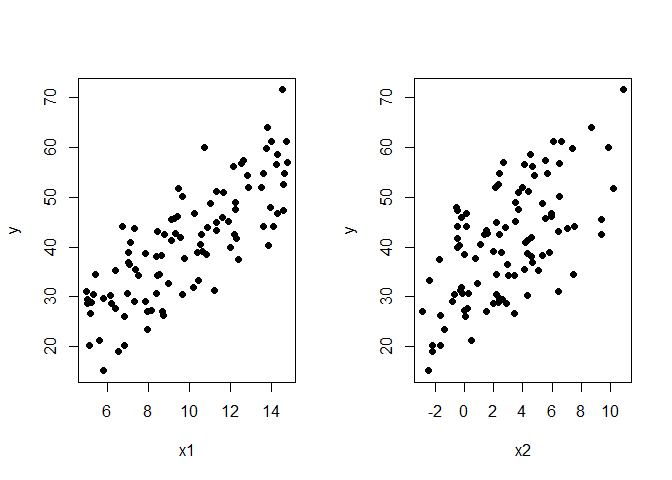

Praktikum 4 Anreg
================
Muhammad Khayruhanif
2026-02-24

# Bangkitkan Data

``` r
set.seed(2026)
n <- 100
p <- 3

x1 <- runif(n,5,15)
x2 <- rnorm(n,3,3)
x0 <- rep(1,n)
X  <- data.frame(x0,x1,x2)
head(X)
```

    ##   x0        x1         x2
    ## 1  1 11.986735 -0.5096960
    ## 2  1 10.565305  2.3813995
    ## 3  1  6.401400  0.2081691
    ## 4  1  7.857233  4.3481927
    ## 5  1 10.553690  1.0655806
    ## 6  1  5.251312  2.3057319

``` r
e  <- rnorm(n,0,3)
y <- 5 + 3*x1 + 2*x2 + e
rand.comp <- data.frame(e,y)
rand.comp
```

    ##               e        y
    ## 1    0.07298025 40.01379
    ## 2    1.00390557 42.46262
    ## 3    2.96823300 27.58877
    ## 4    1.50112534 38.76921
    ## 5    1.73072360 40.52296
    ## 6    3.42807282 28.79347
    ## 7   -2.12234344 30.44637
    ## 8   -1.85567892 44.20891
    ## 9   -0.02494259 34.35383
    ## 10   1.01675920 38.44663
    ## 11   4.21621890 29.54539
    ## 12  -2.59580956 45.16415
    ## 13  -2.62186187 29.11916
    ## 14   2.32295460 52.03169
    ## 15  -1.20567072 19.00300
    ## 16  -0.64541349 34.42250
    ## 17   1.81576839 33.37233
    ## 18  -1.84370305 31.10867
    ## 19  -2.17326879 27.34155
    ## 20  -0.77082791 26.63711
    ## 21  -1.17621821 38.18750
    ## 22  -2.06010589 34.27568
    ## 23   2.62752102 43.68653
    ## 24  -1.44317396 21.31569
    ## 25   0.20507277 41.23675
    ## 26   0.41107468 26.11354
    ## 27  -5.57630556 45.49080
    ## 28   1.03882971 35.36745
    ## 29   4.50490146 28.60773
    ## 30  -0.04121436 48.72197
    ## 31  -2.32573559 44.07110
    ## 32   3.93347441 44.24786
    ## 33   0.78157367 41.78422
    ## 34   3.04205102 20.18590
    ## 35   0.64678263 43.89877
    ## 36   1.84021388 45.70993
    ## 37   4.33796544 36.58611
    ## 38   1.97425770 37.72838
    ## 39   1.12570349 56.82520
    ## 40  -2.02406483 51.86751
    ## 41   1.74144172 27.12642
    ## 42  -1.24268800 59.84220
    ## 43   6.54151196 42.73013
    ## 44   1.02857293 46.11970
    ## 45  -2.39407399 15.11850
    ## 46   4.92310850 30.39802
    ## 47  -1.38001533 46.72647
    ## 48  -4.75941297 27.13580
    ## 49  -3.13474702 31.97820
    ## 50   0.12496100 35.43341
    ## 51  -1.29607913 61.15581
    ## 52   1.37577344 43.38806
    ## 53  -0.68805596 52.69331
    ## 54  -5.57088663 40.34984
    ## 55  -0.86902252 46.80149
    ## 56   5.30142371 56.14987
    ## 57  -1.32804869 37.50556
    ## 58  -1.76659321 34.49676
    ## 59  -0.36176478 47.35679
    ## 60   4.95918385 30.68120
    ## 61  -2.61406371 23.50729
    ## 62   2.34200481 48.04856
    ## 63  -1.84163361 39.05276
    ## 64  -0.98277393 41.87940
    ## 65  -1.06564805 32.65247
    ## 66   2.34280222 29.63902
    ## 67   1.82601052 45.04829
    ## 68   3.22853705 50.20694
    ## 69   3.19667296 60.10043
    ## 70   6.48493924 45.93875
    ## 71   0.21136945 63.98584
    ## 72  -7.60567566 42.55322
    ## 73  -1.62400243 47.47197
    ## 74  -2.32781872 54.78959
    ## 75  -0.88786625 20.26704
    ## 76   3.45411872 51.24815
    ## 77  -1.70666360 42.57193
    ## 78  -2.41735902 38.84435
    ## 79   1.47778159 36.93216
    ## 80   2.10227501 61.30193
    ## 81  -0.72937587 28.70108
    ## 82   1.23744353 71.61610
    ## 83   1.49449593 54.47998
    ## 84   1.10303734 54.75285
    ## 85  -1.71180861 30.36511
    ## 86   2.21644955 56.94147
    ## 87  -6.80487398 31.24879
    ## 88   1.84212312 58.68443
    ## 89   1.21090742 38.97345
    ## 90   6.15473798 40.91743
    ## 91   0.78973496 56.67696
    ## 92   0.33126357 48.93803
    ## 93   3.58729086 57.52597
    ## 94   2.19992854 29.05790
    ## 95  -0.01353507 43.24590
    ## 96  -0.06364650 30.72352
    ## 97   0.41550520 52.06424
    ## 98  -3.21038121 38.37974
    ## 99   3.70818620 51.08470
    ## 100 -1.61943028 26.20570

``` r
dt <- data.frame(y,x1,x2)
dt
```

    ##            y        x1           x2
    ## 1   40.01379 11.986735 -0.509696010
    ## 2   42.46262 10.565305  2.381399519
    ## 3   27.58877  6.401400  0.208169072
    ## 4   38.76921  7.857233  4.348192697
    ## 5   40.52296 10.553690  1.065580636
    ## 6   28.79347  5.251312  2.305731931
    ## 7   30.44637  9.662306 -0.709104034
    ## 8   44.20891 13.610107  0.117134105
    ## 9   34.35383  7.525012  3.401868845
    ## 10  38.44663 10.808063  0.002841831
    ## 11  29.54539  5.059333  2.575587928
    ## 12  45.16415 11.918659  3.501989699
    ## 13  29.11916  7.311250  2.403634162
    ## 14  52.03169 13.485325  2.126378436
    ## 15  19.00300  6.538352 -2.203191103
    ## 16  34.42250  8.568093  2.181815005
    ## 17  33.37233 10.452045 -2.399788445
    ## 18  31.10867  5.011976  6.458222930
    ## 19  27.34155  8.178245 -0.009958457
    ## 20  26.63711  5.172894  3.444630133
    ## 21  38.18750  8.415580  4.558490042
    ## 22  34.27568  8.434388  3.016308883
    ## 23  43.68653  7.325627  7.041062504
    ## 24  21.31569  5.613688  0.458899748
    ## 25  41.23675  9.123763  4.330194052
    ## 26  26.11354  6.855122  0.068551595
    ## 27  45.49080  9.106721  9.373473407
    ## 28  35.36745  6.400809  5.063096882
    ## 29  28.60773  5.054345  1.969895339
    ## 30  48.72197 11.017388  5.355508418
    ## 31  44.07110 14.110101 -0.466732382
    ## 32  44.24786  6.753628  7.526749039
    ## 33  41.78422 12.311874 -0.466488481
    ## 34  20.18590  5.161572 -1.670435431
    ## 35  43.89877 10.861157  2.834256224
    ## 36  45.70993  9.258184  5.547579488
    ## 37  36.58611  7.104910  2.966709832
    ## 38  37.72838  9.772001  0.719058505
    ## 39  56.82520 12.548233  6.527397755
    ## 40  51.86751  9.468293 10.243349127
    ## 41  27.12642  8.712018 -2.875538305
    ## 42  59.84220 13.747784  7.420769680
    ## 43  42.73013  9.345973  1.575348116
    ## 44  46.11970  9.401368  5.943512951
    ## 45  15.11850  5.819568 -2.473065659
    ## 46  30.39802  5.346193  2.218167548
    ## 47  46.72647 14.286520  0.123464062
    ## 48  27.13580  7.945663  1.529112870
    ## 49  31.97820 10.192243 -0.231890141
    ## 50  35.43341  7.363964  4.108277732
    ## 51  61.15581 14.718098  6.648799443
    ## 52  43.38806 11.325115  1.518470293
    ## 53  52.69331 14.582692  2.316645837
    ## 54  40.34984 13.863540 -0.334946661
    ## 55  46.80149 10.231838  5.987499268
    ## 56  56.14987 12.159156  4.685486673
    ## 57  37.50556 12.406427 -1.692835670
    ## 58  34.49676  5.458963  7.443231057
    ## 59  47.35679 14.577929 -0.507615450
    ## 60  30.68120  7.011367 -0.156040612
    ## 61  23.50729  7.984142 -1.415536574
    ## 62  48.04856 13.955727 -0.580310762
    ## 63  39.05276 10.660758  1.956061726
    ## 64  41.87940  9.555080  4.598467629
    ## 65  32.65247  8.994683  0.867034272
    ## 66  29.63902  5.830050  2.403032587
    ## 67  45.04829 11.303507  2.155880029
    ## 68  50.20694  9.650950  6.512778826
    ## 69  60.10043 10.723785  9.866199558
    ## 70  45.93875 11.622317 -0.206569843
    ## 71  63.98584 13.779083  8.718612566
    ## 72  42.55322  8.789370  9.395393155
    ## 73  47.47197 12.235743  3.694369089
    ## 74  54.78959 13.578579  5.690837213
    ## 75  20.26704  6.862555 -2.216378137
    ## 76  51.24815 11.326981  4.406543820
    ## 77  42.57193 12.181158  1.367556980
    ## 78  38.84435 10.418066  2.503757539
    ## 79  36.93216  7.047126  4.656499688
    ## 80  61.30193 13.999890  6.099990635
    ## 81  28.70108  6.235843  2.861463586
    ## 82  71.61610 14.515469 10.916121938
    ## 83  54.47998 12.817151  4.767017248
    ## 84  54.75285 14.621360  2.392867997
    ## 85  30.36511  6.142519  4.324680414
    ## 86  56.94147 14.775521  2.699226894
    ## 87  31.24879 11.204695 -0.280211976
    ## 88  58.68443 14.274273  4.509742016
    ## 89  38.97345  7.022367  5.847720273
    ## 90  40.91743  7.155292  4.148406168
    ## 91  56.67696 14.219252  4.114734633
    ## 92  48.93803 12.221156  3.471649205
    ## 93  57.52597 12.617014  5.543819670
    ## 94  29.05790  7.852775 -0.850177970
    ## 95  43.24590  8.436589  6.474835824
    ## 96  30.72352  8.413934  0.272681361
    ## 97  52.06424 12.879598  4.004972116
    ## 98  38.37974  8.645000  5.327562246
    ## 99  51.08470 11.651226  3.711420457
    ## 100 26.20570  8.728118 -1.679610404

# eksplorasi Data

``` r
par(mfrow=c(1,2))
plot(x1, y, pch=19)
plot(x2, y, pch=19)
```

<!-- -->

# Model Regresi Dengan Matriks

## Parameter Regresi

``` r
y <- as.matrix(y)
X <- as.matrix(cbind(x0,x1,x2))
b <- solve(t(X)%*%X)%*%t(X)%*%y;round(b,4)
```

    ##      [,1]
    ## x0 6.1228
    ## x1 2.9150
    ## x2 2.0150

``` r
b0<-b[1];b0
```

    ## [1] 6.122782

``` r
b1<-b[2];b1
```

    ## [1] 2.914952

``` r
b2<-b[3];b2
```

    ## [1] 2.015027

Didapatkan persamaan regresi yaitu


## Koefisien Determinasi dan Penyesuaiannya

``` r
sigma_kuadrat <- (t(y)%*%y-t(b)%*%t(X)%*%y)/(n-p)
Res_se <- sqrt(sigma_kuadrat)
round(Res_se,3)
```

    ##       [,1]
    ## [1,] 2.756

``` r
df <- n-p
df
```

    ## [1] 97

``` r
y_duga <- b0+b1*x1+b2*x2
Y <- data.frame(y,y_duga);Y
```

    ##            y   y_duga
    ## 1   40.01379 40.03649
    ## 2   42.46262 41.71873
    ## 3   27.58877 25.20202
    ## 4   38.76921 37.78797
    ## 5   40.52296 39.03346
    ## 6   28.79347 26.07622
    ## 7   30.44637 32.85908
    ## 8   44.20891 46.03162
    ## 9   34.35383 34.91269
    ## 10  38.44663 37.63350
    ## 11  29.54539 26.06037
    ## 12  45.16415 47.92171
    ## 13  29.11916 32.27812
    ## 14  52.03169 49.71657
    ## 15  19.00300 20.74228
    ## 16  34.42250 35.49478
    ## 17  33.37233 31.75435
    ## 18  31.10867 33.74595
    ## 19  27.34155 29.94191
    ## 20  26.63711 28.14254
    ## 21  38.18750 39.83928
    ## 22  34.27568 36.78656
    ## 23  43.68653 41.66457
    ## 24  21.31569 23.41111
    ## 25  41.23675 41.44357
    ## 26  26.11354 26.24327
    ## 27  45.49080 51.55624
    ## 28  35.36745 34.98311
    ## 29  28.60773 24.82535
    ## 30  48.72197 49.02944
    ## 31  44.07110 46.31257
    ## 32  44.24786 40.97589
    ## 33  41.78422 41.07132
    ## 34  20.18590 17.80254
    ## 35  43.89877 43.49364
    ## 36  45.70993 44.28847
    ## 37  36.58611 32.81126
    ## 38  37.72838 36.05662
    ## 39  56.82520 55.85316
    ## 40  51.86751 54.36303
    ## 41  27.12642 25.72361
    ## 42  59.84220 61.14997
    ## 43  42.73013 36.54022
    ## 44  46.11970 45.50366
    ## 45  15.11850 18.10325
    ## 46  30.39802 26.17635
    ## 47  46.72647 48.01609
    ## 48  27.13580 32.36521
    ## 49  31.97820 35.36542
    ## 50  35.43341 35.86668
    ## 51  61.15581 62.42285
    ## 52  43.38806 42.19471
    ## 53  52.69331 53.29873
    ## 54  40.34984 45.85941
    ## 55  46.80149 48.01307
    ## 56  56.14987 51.00752
    ## 57  37.50556 38.87581
    ## 58  34.49676 37.03371
    ## 59  47.35679 47.59389
    ## 60  30.68120 26.24615
    ## 61  23.50729 26.54383
    ## 62  48.04856 45.63371
    ## 63  39.05276 41.13990
    ## 64  41.87940 43.24142
    ## 65  32.65247 34.08895
    ## 66  29.63902 27.95928
    ## 67  45.04829 43.41612
    ## 68  50.20694 47.37827
    ## 69  60.10043 57.26276
    ## 70  45.93875 39.58503
    ## 71  63.98584 63.85639
    ## 72  42.55322 50.67535
    ## 73  47.47197 49.23364
    ## 74  54.78959 57.17088
    ## 75  20.26704 21.66074
    ## 76  51.24815 48.01970
    ## 77  42.57193 44.38594
    ## 78  38.84435 41.53609
    ## 79  36.93216 36.04779
    ## 80  61.30193 59.22344
    ## 81  28.70108 30.06589
    ## 82  71.61610 70.43096
    ## 83  54.47998 53.08983
    ## 84  54.75285 53.56504
    ## 85  30.36511 32.74228
    ## 86  56.94147 54.63173
    ## 87  31.24879 38.21930
    ## 88  58.68443 56.81886
    ## 89  38.97345 38.37596
    ## 90  40.91743 35.33927
    ## 91  56.67696 55.86252
    ## 92  48.93803 48.74233
    ## 93  57.52597 54.07172
    ## 94  29.05790 27.30011
    ## 95  43.24590 43.76201
    ## 96  30.72352 31.19846
    ## 97  52.06424 51.73632
    ## 98  38.37974 42.05773
    ## 99  51.08470 47.56416
    ## 100 26.20570 28.18037

``` r
R_squared <- (cor(y,y_duga))^2;round(R_squared,4)
```

    ##        [,1]
    ## [1,] 0.9425

``` r
R_squared_adj <- 1-((1-R_squared)*(n-1)/(n-p));round(R_squared_adj,4)
```

    ##        [,1]
    ## [1,] 0.9414

## Uji F dan Standar Error Parameter

``` r
KTReg <- sum((y_duga-mean(y))^2)/(p-1)
galat <- y-(b0+b1*x1+b2*x2)
KTG   <- sum(galat^2)/(n-p)
Fhit  <- KTReg/KTG;round(Fhit,0)
```

    ## [1] 796

``` r
dbreg <- p-1;dbreg
```

    ## [1] 2

``` r
dbg <- n-p;dbg
```

    ## [1] 97

``` r
pf(Fhit, dbreg, dbg, lower.tail = F)
```

    ## [1] 6.772675e-61

``` r
se_b <- sqrt(sigma_kuadrat[1]*solve(t(X)%*%X))
```

    ## Warning in sqrt(sigma_kuadrat[1] * solve(t(X) %*% X)): NaNs produced

``` r
cov_beta <- sigma_kuadrat[1] * solve(t(X) %*% X)
se_b <- sqrt(diag(cov_beta)); round(se_b,4)
```

    ##     x0     x1     x2 
    ## 0.9888 0.0951 0.0881

## Signifikansi Parameter (nilai t)

``` r
t_b0 <- b0/se_b[1];round(t_b0,2)
```

    ##   x0 
    ## 6.19

``` r
2*pt(-abs(t_b0 ),df <- n-p)
```

    ##           x0 
    ## 1.427277e-08

``` r
t_b1 <- b1/se_b[2];round(t_b1,2)
```

    ##    x1 
    ## 30.65

``` r
2*pt(-abs(t_b1 ),df <- n-p)
```

    ##           x1 
    ## 1.076373e-51

``` r
t_b2 <- b2/se_b[3];round(t_b2,2)
```

    ##    x2 
    ## 22.88

``` r
2*pt(-abs(t_b2 ),df <- n-p)
```

    ##           x2 
    ## 7.245328e-41

## Selang Kepercayaan *100%")

``` r
t <- qt(.975, df <- n-p)

BB_b0 <- b0-t*se_b[1]
BA_b0 <- b0+t*se_b[1]

BB_b1 <- b1-t*se_b[2]
BA_b1 <- b1+t*se_b[2]

BB_b2 <- b2-t*se_b[3]
BA_b2 <- b2+t*se_b[3]

Batas.Bawah <- as.matrix(c(round(BB_b0,6),round(BB_b1,6),round(BB_b2,6)))
Batas.Atas <- as.matrix(c(round(BA_b0,6),round(BA_b1,6),round(BA_b2,6)))

Selang.Kepercayaan <- cbind(Batas.Bawah, Batas.Atas)
colnames(Selang.Kepercayaan ) <- c("Batas bawah Selang (2.5%)", "Batas atas Selang (97.5%)")
rownames(Selang.Kepercayaan ) <- c("Intersept", "b1", "b2")
Selang.Kepercayaan
```

    ##           Batas bawah Selang (2.5%) Batas atas Selang (97.5%)
    ## Intersept                  4.160319                  8.085246
    ## b1                         2.726202                  3.103702
    ## b2                         1.840205                  2.189850

# Model Regresi Dengan Fungsi lm()

Dalam penggunaan fungsi `lm`, kita akan memperoleh secara langsung
nilai-nilai pada pemodelan regresi dari data yang kita miliki. Hanya
dengan mengeluarkan summary, anova dan ditambah confint dari model yang
terbentuk maka dapat diperoleh nilai parameter, signifikansinya, standar
eror, koefisien determinasi hingga selang kepercayaannya.

``` r
model_reg <- lm(y~x1+x2, data= dt)
summary(model_reg)
```

    ## 
    ## Call:
    ## lm(formula = y ~ x1 + x2, data = dt)
    ## 
    ## Residuals:
    ##     Min      1Q  Median      3Q     Max 
    ## -8.1221 -1.8162  0.0534  1.6993  6.3537 
    ## 
    ## Coefficients:
    ##             Estimate Std. Error t value Pr(>|t|)    
    ## (Intercept)  6.12278    0.98878   6.192 1.43e-08 ***
    ## x1           2.91495    0.09510  30.651  < 2e-16 ***
    ## x2           2.01503    0.08808  22.876  < 2e-16 ***
    ## ---
    ## Signif. codes:  0 '***' 0.001 '**' 0.01 '*' 0.05 '.' 0.1 ' ' 1
    ## 
    ## Residual standard error: 2.756 on 97 degrees of freedom
    ## Multiple R-squared:  0.9425, Adjusted R-squared:  0.9414 
    ## F-statistic: 795.5 on 2 and 97 DF,  p-value: < 2.2e-16

Didapatkan persamaan regresi yaitu


``` r
anova(model_reg)
```

    ## Analysis of Variance Table
    ## 
    ## Response: y
    ##           Df Sum Sq Mean Sq F value    Pr(>F)    
    ## x1         1 8109.8  8109.8 1067.69 < 2.2e-16 ***
    ## x2         1 3975.0  3975.0  523.32 < 2.2e-16 ***
    ## Residuals 97  736.8     7.6                      
    ## ---
    ## Signif. codes:  0 '***' 0.001 '**' 0.01 '*' 0.05 '.' 0.1 ' ' 1

``` r
confint(model_reg, level = 0.95)
```

    ##                2.5 %   97.5 %
    ## (Intercept) 4.160319 8.085246
    ## x1          2.726202 3.103702
    ## x2          1.840205 2.189850

# Perbandingan Hasil

``` r
koef<- as.matrix(model_reg$coefficients)
penduga <- cbind(b, koef)
colnames(penduga) <- c('matriks', 'fungsi lm')
rownames(penduga) <- c("intersep", "b1", "b2")
penduga
```

    ##           matriks fungsi lm
    ## intersep 6.122782  6.122782
    ## b1       2.914952  2.914952
    ## b2       2.015027  2.015027

Berdasar perbandingan ini diperoleh hasil yang sama yang artinya
penggunaan matriks secara manual sudah tepat dalam memodelkan regresi
linear berganda bergitu pula sebaliknya.
