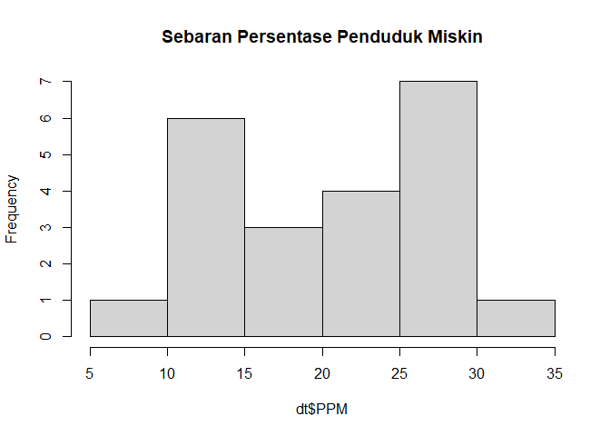
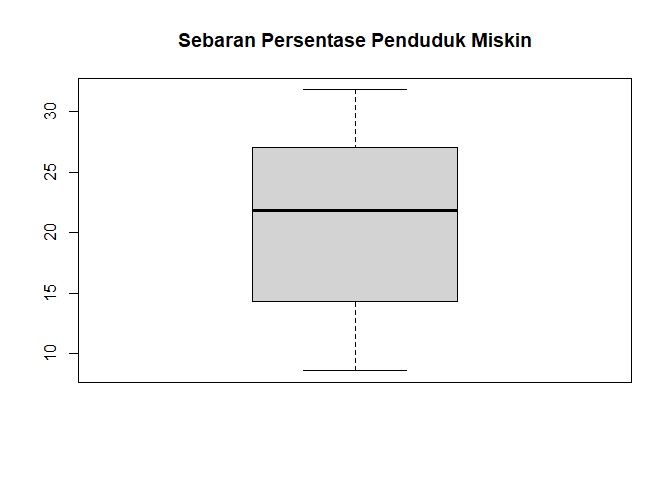
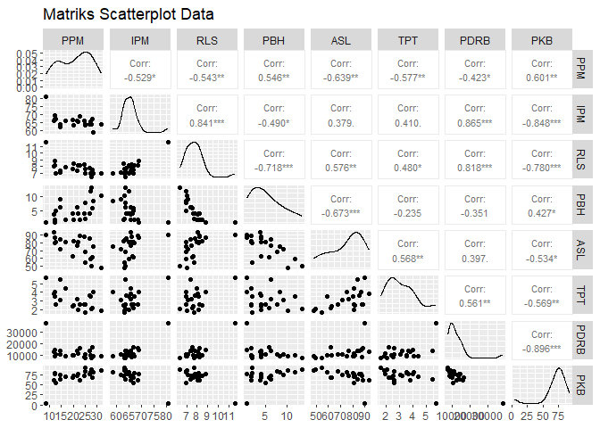
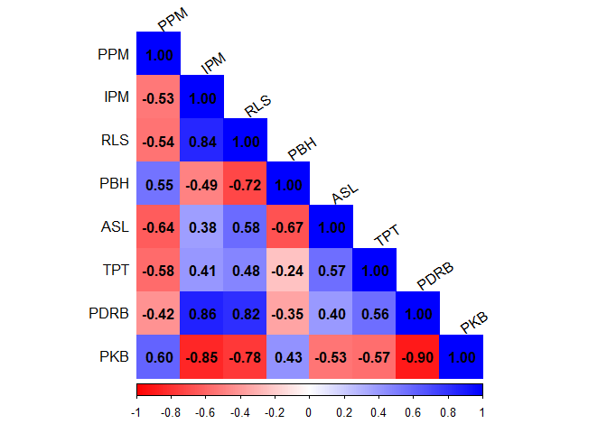

Praktikum Anreg Minggu ke-5
================
Muhammad Khayruhanif
2026-03-06

# Library

``` r
library(readxl) # untuk membaca data
```

    ## Warning: package 'readxl' was built under R version 4.5.2

``` r
library(GGally) # untuk menghasilkan matriks hubungan antarpeubah
```

    ## Warning: package 'GGally' was built under R version 4.5.2

    ## Loading required package: ggplot2

    ## Warning: package 'ggplot2' was built under R version 4.5.2

``` r
library(corrplot) # untuk menghasilkan matriks korelasi
```

    ## Warning: package 'corrplot' was built under R version 4.5.2

    ## corrplot 0.95 loaded

``` r
library(dplyr) # untuk manipulasi data
```

    ## 
    ## Attaching package: 'dplyr'

    ## The following objects are masked from 'package:stats':
    ## 
    ##     filter, lag

    ## The following objects are masked from 'package:base':
    ## 
    ##     intersect, setdiff, setequal, union

``` r
library(car) # untuk memeriksa multikolinearitas
```

    ## Loading required package: carData

    ## 
    ## Attaching package: 'car'

    ## The following object is masked from 'package:dplyr':
    ## 
    ##     recode

# Data

``` r
data <- read_excel("C:\\Users\\ASUS\\Downloads\\Data NTT.xlsx")
head(data) # menampilkan sekian data awal
```

    ## # A tibble: 6 × 10
    ##   Wilayah                PPM   IPM   RLS   PBH   ASL   TPT  PDRB   PKB UHH      
    ##   <chr>                <dbl> <dbl> <dbl> <dbl> <dbl> <dbl> <dbl> <dbl> <chr>    
    ## 1 Sumba Barat           27.2  65.2  6.92 11.9   58.8  3.52 10199  82.8 Tahan    
    ## 2 Sumba Timur           28.1  67.0  7.57  5.87  61.8  2.21 16617  68.8 Agak Tah…
    ## 3 Kupang                21.8  65.8  7.42  6.17  76.4  3.22 13793  72.8 Agak Tah…
    ## 4 Timor Tengah Selatan  25.2  63.6  6.97  7.71  67.9  2.64 10953  83.8 Agak Tah…
    ## 5 Timor Tengah Utara    21.8  65.2  8.16  3.98  80.6  1.96 11511  77.6 Tahan    
    ## 6 Belu                  14.3  63.8  7.39  6.34  84.0  5.45 13997  65.5 Agak Tah…

``` r
str(data) # menampilkan tipe data setiap peubah
```

    ## tibble [22 × 10] (S3: tbl_df/tbl/data.frame)
    ##  $ Wilayah: chr [1:22] "Sumba Barat" "Sumba Timur" "Kupang" "Timor Tengah Selatan" ...
    ##  $ PPM    : num [1:22] 27.2 28.1 21.8 25.2 21.9 ...
    ##  $ IPM    : num [1:22] 65.2 67 65.8 63.6 65.2 ...
    ##  $ RLS    : num [1:22] 6.92 7.57 7.42 6.97 8.16 7.39 8.45 8.26 8.04 6.98 ...
    ##  $ PBH    : num [1:22] 11.9 5.87 6.17 7.71 3.98 6.34 1.75 3.95 3.69 5.02 ...
    ##  $ ASL    : num [1:22] 58.8 61.8 76.4 67.9 80.6 ...
    ##  $ TPT    : num [1:22] 3.52 2.21 3.22 2.64 1.96 5.45 2.52 2.55 3.79 2.62 ...
    ##  $ PDRB   : num [1:22] 10199 16617 13793 10953 11511 ...
    ##  $ PKB    : num [1:22] 82.8 68.8 72.8 83.8 77.7 ...
    ##  $ UHH    : chr [1:22] "Tahan" "Agak Tahan" "Agak Tahan" "Agak Tahan" ...

``` r
summary(data) # menampilkan ringkasan data
```

    ##    Wilayah               PPM             IPM             RLS        
    ##  Length:22          Min.   : 8.61   Min.   :58.89   Min.   : 6.380  
    ##  Class :character   1st Qu.:14.33   1st Qu.:63.62   1st Qu.: 7.032  
    ##  Mode  :character   Median :21.82   Median :65.50   Median : 7.665  
    ##                     Mean   :20.64   Mean   :65.71   Mean   : 7.796  
    ##                     3rd Qu.:26.58   3rd Qu.:66.77   3rd Qu.: 8.155  
    ##                     Max.   :31.78   Max.   :80.62   Max.   :11.620  
    ##       PBH              ASL             TPT             PDRB      
    ##  Min.   : 0.760   Min.   :48.22   Min.   :1.630   Min.   : 7706  
    ##  1st Qu.: 1.885   1st Qu.:64.05   1st Qu.:2.460   1st Qu.: 9064  
    ##  Median : 4.020   Median :80.31   Median :2.850   Median :10797  
    ##  Mean   : 5.195   Mean   :74.78   Mean   :3.160   Mean   :12471  
    ##  3rd Qu.: 7.367   3rd Qu.:84.68   3rd Qu.:3.755   3rd Qu.:13914  
    ##  Max.   :13.390   Max.   :93.03   Max.   :5.690   Max.   :38169  
    ##       PKB            UHH           
    ##  Min.   : 4.29   Length:22         
    ##  1st Qu.:68.49   Class :character  
    ##  Median :75.14   Mode  :character  
    ##  Mean   :72.22                     
    ##  3rd Qu.:82.31                     
    ##  Max.   :93.27

Data yang digunakan adalah data dari 22 Kabupaten/Kota di Nusa Tenggara
Timur pada Tahun 2022 dengan 1 peubah respon yaitu Persentase Penduduk
Miskin (PPM) dan 8 peubah penjelas yang terdiri dari 7 peubah
kuantitatif dan 1 peubah kualitatif. Peubah tersebut adalah Indeks
Pembangunan Manusia (IPM), rata-rata lama sekolah (RLS), persentase
penduduk buta huruf (PBH), persentase akses sanitasi layak (ASL),
persentase tingkat pengangguran terbuka (TPT), Produk Domestik Regional
Bruto (PDRB), persentase penduduk yang menggunakan kayu bakar (PKB), dan
kategori umur harapan hidup (UHH).

Untuk mempermudah dalam komputasi, karena peubah wilayah tidak
digunakan, maka dapat dihapus. Pada praktikum kali ini akan dilakukan
dua pemodelan, yakni model dengan seluruh peubah kuantitatif dan model
dengan adanya peubah kualitatif, supaya lebih mudah dalam analisisnya
maka akan dibentuk dua data berbeda.

``` r
data <- select(data, -Wilayah)
dt <- select(data, -UHH)
```

# Eksplorasi data

``` r
hist(dt$PPM, main = "Sebaran Persentase Penduduk Miskin")
```

<!-- -->

``` r
boxplot(dt$PPM, main = "Sebaran Persentase Penduduk Miskin")
```

<!-- -->

``` r
ggpairs(dt,
        upper = list(continuous = wrap('cor', size = 3)),
        title = "Matriks Scatterplot Data")
```

<!-- -->

``` r
cor_matrix <- cor(dt, use = "complete.obs")

corrplot(cor_matrix, method = "color", type = "lower",
         col = colorRampPalette(c("red", "white", "blue"))(200),
         addCoef.col = "black", tl.col = "black", tl.srt = 35)
```

<!-- -->

Hasil matriks scatter plot dan korelasi menunjukkan bahwa peubah respon
PPM memiliki hubungan positif dengan PBH dan PKB, serta hubungan negatif
dengan IPM, RLS, ASL, TPT, dan PDRB. Semua peubah ini secara signifikan
memiliki korelasi dengan PPM.

Selain itu, terdapat banyak korelasi tinggi antar peubah penjelas, baik
lebih dari 0.5 maupun kurang dari -0.5. Beberapa di antaranya adalah: 1.
RLS dan IPM memiliki korelasi 0.84. 2. PDRB dengan IPM dan RLS
masing-masing sebesar 0.86 dan 0.82. 3. PKB dengan IPM dan PDRB
menunjukkan korelasi negatif yang cukup kuat, yaitu -0.85 dan -0.9.

Korelasi yang tinggi ini mengindikasikan adanya potensi
multikolinearitas, yang dapat mempengaruhi keakuratan model yang akan
dibentuk.

# Pemodelan

## Tanpa Fungsi

Perhitungan nilai

secara matriks dapat dilakukan dengan rumus berikut.

^{-1} X'y")

``` r
# pembentukan matriks
n <- nrow(dt)
x0 <- rep(1,n)
x <- data.frame(x0, dt$IPM, dt$RLS, dt$PBH, dt$ASL,
                dt$TPT, dt$PDRB, dt$PKB)
x <- as.matrix(x)
y <- dt$PPM
```

``` r
beta_duga <- solve(t(x)%*%x)%*%t(x)%*%y
beta_duga
```

    ##                  [,1]
    ## x0      49.5341950820
    ## dt.IPM  -0.7714211554
    ## dt.RLS   0.6927866809
    ## dt.PBH   0.4449884174
    ## dt.ASL  -0.0624482826
    ## dt.TPT  -2.5649472554
    ## dt.PDRB  0.0008452321
    ## dt.PKB   0.2258630575

Hasil tersebut menjelaskan bahwa persamaan yang terbentuk adalah


Selang kepercayaan dan pengujian signifikansi setiap parameter dapat
dilakukan dengan menghitung keragaman tiap dugaan parameter. Secara
umum, nilai ragam dugaan parameter

dapat dihitung melalui rumus berikut.

 = \hat{\sigma}^2 C_{jj}")

Dengan matriks  adalah
matriks
^{-1}")

``` r
c <- data.frame(solve(t(x)%*%x))
```

Unsur diagonal dari matriks
 dapat digunakan untuk
menghitung nilai galat baku dari setiap dugaan parameter. Galat baku ini
dapat digunakan untuk menghitung selang kepercayaan dari dugaan yang
dihasilkan.

 = \sqrt{Var(\hat{\beta}_j)} = \sqrt{\sigma^2 C_{jj}} = \hat{\sigma}\sqrt{c_{ii}}")

Misal ingin dihitung selang kepercayaan dari dugaan parameter
,
maka

``` r
y_hat <- x %*% beta_duga
residuals <- y - y_hat
n <- nrow(x)
p <- ncol(x)
KTG <- sum(residuals^2) / (n - p) 

c22 <- c[2,2]

(se.b2 <- sqrt(KTG*c22))
```

    ## [1] 0.6623855

``` r
alfa <- 0.05

#Batas Bawah beta2
(bb.b2 <- beta_duga[3,1] - abs(qt(alfa/2, df=n-p))*se.b2)
```

    ##    dt.RLS 
    ## -0.727889

``` r
#Batas Atas beta2
(ba.b2 <- beta_duga[3,1] + abs(qt(alfa/2, df=n-p))*se.b2)
```

    ##   dt.RLS 
    ## 2.113462

Dengan demikian, kita dapat ketahui selang kepercayaan untuk

sebagai berikut.


Pada kasus selang kepercayaan

di atas, didapati bahwa dugaan parameter berada dalam rentang yang
mengandung nilai 0. Dengan demikian, dapat dimaknai bahwa diduga nilai
parameter

bernilai 0 atau tidak signifikan dalam taraf nyata 5%.

# Dengan Fungsi

``` r
model1 <- lm(formula = PPM ~ ., data = dt)
summary(model1)
```

    ## 
    ## Call:
    ## lm(formula = PPM ~ ., data = dt)
    ## 
    ## Residuals:
    ##      Min       1Q   Median       3Q      Max 
    ## -10.3560  -2.0103  -0.4573   3.0122   6.7887 
    ## 
    ## Coefficients:
    ##               Estimate Std. Error t value Pr(>|t|)  
    ## (Intercept) 49.5341951 52.0758489   0.951    0.358  
    ## IPM         -0.7714212  0.6623855  -1.165    0.264  
    ## RLS          0.6927867  3.0586518   0.227    0.824  
    ## PBH          0.4449884  0.6039911   0.737    0.473  
    ## ASL         -0.0624483  0.1423560  -0.439    0.668  
    ## TPT         -2.5649473  1.3939114  -1.840    0.087 .
    ## PDRB         0.0008452  0.0005297   1.596    0.133  
    ## PKB          0.2258631  0.1616275   1.397    0.184  
    ## ---
    ## Signif. codes:  0 '***' 0.001 '**' 0.01 '*' 0.05 '.' 0.1 ' ' 1
    ## 
    ## Residual standard error: 4.831 on 14 degrees of freedom
    ## Multiple R-squared:  0.6599, Adjusted R-squared:  0.4898 
    ## F-statistic: 3.881 on 7 and 14 DF,  p-value: 0.01481

Dugaan parameter model secara matriks dan fungsi menghasilkan angka yang
sama, sehingga perhitungan matriks memang sudah tepat. Pada ringkasan
model ini dapat dilihat bahwa tidak ada parameter yang signifikan pada
taraf nyata 5%, namun secara simultan model ini signifikan dengan nilai
p yang lebih kecil dari alpha yaitu 0.0148. Hal ini mengindikasi model
yang buruk, kemungkinan terjadi pelanggaran asumsi sisaan maupun
multikolinearitas, yang ditunjukkan pula dengan perubahan tanda korelasi
pada peubah RLS.

# Pemeriksaan Multikoliniearitas

``` r
vif(model1)
```

    ##       IPM       RLS       PBH       ASL       TPT      PDRB       PKB 
    ##  6.429484  9.244873  4.315075  3.269676  2.107777 10.014754  7.471208

Hasil uji ini menunjukkan peubah PDRB memiliki nilai VIF yang sangat
tinggi (\>10), bahkan peubah IPM, RLS, dan PKB juga tergolong tinggi
(\>5). Pada analisis kali ini, penanganan dilakukan dengan menghapus dua
peubah dengan VIF tertinggi yaitu PDRB dan RLS.

# Pemodelan Kedua

``` r
model2 <- lm(PPM ~ IPM + PBH + ASL + TPT + PKB, data = dt)
summary(model2)
```

    ## 
    ## Call:
    ## lm(formula = PPM ~ IPM + PBH + ASL + TPT + PKB, data = dt)
    ## 
    ## Residuals:
    ##     Min      1Q  Median      3Q     Max 
    ## -9.2108 -2.5802  0.2257  2.5851  8.2886 
    ## 
    ## Coefficients:
    ##             Estimate Std. Error t value Pr(>|t|)
    ## (Intercept) 37.22375   54.43625   0.684    0.504
    ## IPM         -0.14999    0.59580  -0.252    0.804
    ## PBH          0.42721    0.49192   0.868    0.398
    ## ASL         -0.10503    0.14929  -0.704    0.492
    ## TPT         -1.71760    1.41071  -1.218    0.241
    ## PKB          0.05995    0.14296   0.419    0.681
    ## 
    ## Residual standard error: 5.133 on 16 degrees of freedom
    ## Multiple R-squared:  0.5612, Adjusted R-squared:  0.4241 
    ## F-statistic: 4.093 on 5 and 16 DF,  p-value: 0.01387

Persamaan yang terbentuk adalah


``` r
vif(model2)
```

    ##      IPM      PBH      ASL      TPT      PKB 
    ## 4.607747 2.535496 3.185280 1.912361 5.177923

Model hasil reduksi peubah menunjukkan bahwa nilai VIF \< 10 sehingga
dinyatakan tidak terjadi multikolinearitas. Namun seluruh parameter
masih tidak signifikan, padahal secara simultan model ini sudah
signifikan. Artinya ada permasalahan lain yang mungkin belum tertangani,
perlu dilakuan uji asumsi dan pemeriksaan pencilan, leverage, dan amatan
berpengaruh

# Pemodelan Dummy

Untuk melakukan pemodelan regresi dengan peubah dummy, peubah kualitatif
harus diubah menjadi tipe faktor agar bisa dilakukan regresi. Nilai yang
menjadi referensi pemodelan jika langsung menggunakan `as.factor()`
adalah nilai dengan urutan abjad pertama, pada data ini adalah “Agak
Rentan”

``` r
data$UHH <- as.factor(data$UHH)
str(data)
```

    ## tibble [22 × 9] (S3: tbl_df/tbl/data.frame)
    ##  $ PPM : num [1:22] 27.2 28.1 21.8 25.2 21.9 ...
    ##  $ IPM : num [1:22] 65.2 67 65.8 63.6 65.2 ...
    ##  $ RLS : num [1:22] 6.92 7.57 7.42 6.97 8.16 7.39 8.45 8.26 8.04 6.98 ...
    ##  $ PBH : num [1:22] 11.9 5.87 6.17 7.71 3.98 6.34 1.75 3.95 3.69 5.02 ...
    ##  $ ASL : num [1:22] 58.8 61.8 76.4 67.9 80.6 ...
    ##  $ TPT : num [1:22] 3.52 2.21 3.22 2.64 1.96 5.45 2.52 2.55 3.79 2.62 ...
    ##  $ PDRB: num [1:22] 10199 16617 13793 10953 11511 ...
    ##  $ PKB : num [1:22] 82.8 68.8 72.8 83.8 77.7 ...
    ##  $ UHH : Factor w/ 4 levels "Agak Rentan",..: 4 2 2 2 4 2 1 4 2 4 ...

``` r
model3 <- lm(PPM ~ ., data = data)
summary(model3)
```

    ## 
    ## Call:
    ## lm(formula = PPM ~ ., data = data)
    ## 
    ## Residuals:
    ##     Min      1Q  Median      3Q     Max 
    ## -8.5736 -2.3108  0.0748  2.4920  7.6361 
    ## 
    ## Coefficients:
    ##                   Estimate Std. Error t value Pr(>|t|)
    ## (Intercept)      38.565641  82.442972   0.468    0.649
    ## IPM              -0.510867   1.333242  -0.383    0.709
    ## RLS              -0.599294   5.775211  -0.104    0.919
    ## PBH               0.413019   0.790145   0.523    0.612
    ## ASL              -0.047268   0.212586  -0.222    0.828
    ## TPT              -2.570133   1.640495  -1.567    0.145
    ## PDRB              0.001198   0.001061   1.129    0.283
    ## PKB               0.257873   0.235222   1.096    0.296
    ## UHHAgak Tahan    -4.808935   6.031166  -0.797    0.442
    ## UHHSangat Tahan -10.081057  26.029549  -0.387    0.706
    ## UHHTahan         -3.057590   7.247243  -0.422    0.681
    ## 
    ## Residual standard error: 5.287 on 11 degrees of freedom
    ## Multiple R-squared:   0.68,  Adjusted R-squared:  0.3891 
    ## F-statistic: 2.337 on 10 and 11 DF,  p-value: 0.0899

Persamaan yang terbentuk dari pemodelan ini adalah sebagai berikut:


Interpretasi pada peubah dengan nilai kuantitatif sama seperti
interpretasi biasanya, yang berbeda hanya pada peubah dummynya. Pada
persamaan tersebut, interpretasi yang dapat ditulis adalah sebagai
berikut  
1. Wilayah dengan kondisi UHH Agak Tahan memiliki dugaan rata-rata
persentase penduduk miskin 4.8089% lebih rendah dibanding dengan wilayah
yang memiliki tingkat kondisi UHH Agak Rentan  
2. Wilayah dengan kondisi UHH Sangat Tahan memiliki dugaan rata-rata
persentase penduduk miskin 10.0811% lebih rendah dibanding dengan
wilayah yang memiliki tingkat kondisi UHH Agak Rentan  
3. Wilayah dengan kondisi UHH Tahan memiliki dugaan rata-rata persentase
penduduk miskin 3.0576% lebih rendah dibanding dengan wilayah yang
memiliki tingkat kondisi UHH Agak Rentan  

# Uji Hipotesis Kesamaan Parameter Regresi

Misal ingin dilakukan pemodelan dengan peubah respon Persentase Penduduk
Miskin dengan 4 peubah penjelas, yaitu IPM, RLS, TBH, TPT

``` r
model4 <- lm(PPM ~ IPM + RLS + PBH + TPT, data = dt)
summary(model4)
```

    ## 
    ## Call:
    ## lm(formula = PPM ~ IPM + RLS + PBH + TPT, data = dt)
    ## 
    ## Residuals:
    ##      Min       1Q   Median       3Q      Max 
    ## -11.1510  -2.4744   0.6471   3.0471   7.8279 
    ## 
    ## Coefficients:
    ##             Estimate Std. Error t value Pr(>|t|)  
    ## (Intercept)  51.3386    22.2435   2.308   0.0338 *
    ## IPM          -0.7469     0.5208  -1.434   0.1696  
    ## RLS           2.9004     2.6507   1.094   0.2891  
    ## PBH           1.0000     0.4576   2.185   0.0432 *
    ## TPT          -2.9849     1.1438  -2.610   0.0183 *
    ## ---
    ## Signif. codes:  0 '***' 0.001 '**' 0.01 '*' 0.05 '.' 0.1 ' ' 1
    ## 
    ## Residual standard error: 4.963 on 17 degrees of freedom
    ## Multiple R-squared:  0.5642, Adjusted R-squared:  0.4616 
    ## F-statistic: 5.501 on 4 and 17 DF,  p-value: 0.004982

``` r
vif(model4)
```

    ##      IPM      RLS      PBH      TPT 
    ## 3.765798 6.579019 2.347041 1.344870

Regresi yang dihasilkan tidak mengalami masalah multikolinearitas. Hasil
tersebut menunjukkan bahwa peubah PBH dan TPT signifikan pada taraf
nyata 5%, sedangkan IPM dan RLS tidak signifikan. Berikut adalah
persamaan yang terbentuk


Hasil pemodelan tersebut dapat dilakukan serangkaian uji untuk memeriksa
apakah dan
 dapat
diasumsikan sama ketika parameter lainnya tidak signifikan atau
diasumsikan sama dengan nol.

Hipotesis yang diuji adalah


Karena peubah IPM dan RLS tidak signifikan maka dapat diasumsikan nol
sehingga model dapat disederhanakan menjadi:


Jika  benar
"),
model bisa ditulis ulang sebagai

+ε")

``` r
# Buat peubah baru
dt$X_new <- dt$PBH + dt$TPT

# Model penuh (Full Model)
model_full <- lm(PPM ~ PBH + TPT, data = dt)

# Model terbatas (Restricted Model)
model_restricted <- lm(PPM ~ X_new, data = dt)

# Bandingkan dengan Uji F
anova(model_restricted, model_full)
```

    ## Analysis of Variance Table
    ## 
    ## Model 1: PPM ~ X_new
    ## Model 2: PPM ~ PBH + TPT
    ##   Res.Df    RSS Df Sum of Sq      F   Pr(>F)   
    ## 1     20 821.64                                
    ## 2     19 469.49  1    352.15 14.251 0.001281 **
    ## ---
    ## Signif. codes:  0 '***' 0.001 '**' 0.01 '*' 0.05 '.' 0.1 ' ' 1

Hasil perbandingan menunjukkan bahwa nilai p kurang dari alpha sehingga
dapat disimpulkan bahwa tolak H0, artinya peubah PBH dan TPT berbeda
secara signifikan sehingga tidak dapat digabung. Selanjutnya daoat
dipilih apakah akan menggunakan peubah dengan 4 peubah atau hanya 2
peubah berdasarkan indikator Adjusted R-Squared, AIC, dan BIC.

``` r
model_all <- lm(PPM ~ IPM + RLS + PBH + TPT, data = dt)
summary(model_all)
```

    ## 
    ## Call:
    ## lm(formula = PPM ~ IPM + RLS + PBH + TPT, data = dt)
    ## 
    ## Residuals:
    ##      Min       1Q   Median       3Q      Max 
    ## -11.1510  -2.4744   0.6471   3.0471   7.8279 
    ## 
    ## Coefficients:
    ##             Estimate Std. Error t value Pr(>|t|)  
    ## (Intercept)  51.3386    22.2435   2.308   0.0338 *
    ## IPM          -0.7469     0.5208  -1.434   0.1696  
    ## RLS           2.9004     2.6507   1.094   0.2891  
    ## PBH           1.0000     0.4576   2.185   0.0432 *
    ## TPT          -2.9849     1.1438  -2.610   0.0183 *
    ## ---
    ## Signif. codes:  0 '***' 0.001 '**' 0.01 '*' 0.05 '.' 0.1 ' ' 1
    ## 
    ## Residual standard error: 4.963 on 17 degrees of freedom
    ## Multiple R-squared:  0.5642, Adjusted R-squared:  0.4616 
    ## F-statistic: 5.501 on 4 and 17 DF,  p-value: 0.004982

``` r
model_signif <- lm(PPM ~ PBH + TPT, data = dt)
summary(model_signif)
```

    ## 
    ## Call:
    ## lm(formula = PPM ~ PBH + TPT, data = dt)
    ## 
    ## Residuals:
    ##     Min      1Q  Median      3Q     Max 
    ## -9.6222 -2.4343  0.3893  3.1451  8.8971 
    ## 
    ## Coefficients:
    ##             Estimate Std. Error t value Pr(>|t|)    
    ## (Intercept)  25.6845     4.0511   6.340 4.39e-06 ***
    ## PBH           0.8096     0.3078   2.631  0.01647 *  
    ## TPT          -2.9286     1.0163  -2.882  0.00956 ** 
    ## ---
    ## Signif. codes:  0 '***' 0.001 '**' 0.01 '*' 0.05 '.' 0.1 ' ' 1
    ## 
    ## Residual standard error: 4.971 on 19 degrees of freedom
    ## Multiple R-squared:  0.5114, Adjusted R-squared:   0.46 
    ## F-statistic: 9.943 on 2 and 19 DF,  p-value: 0.001109

``` r
perbandingan <- data.frame(
  Model = c("Peubah Penuh", "Peubah Signifikan"),
  Adjusted_R2 = as.numeric(c(summary(model_all)$adj.r.squared, summary(model_signif)$adj.r.squared)),
  AIC = as.numeric(c(AIC(model_all), AIC(model_signif))),
  BIC = as.numeric(c(BIC(model_all), BIC(model_signif)))
)
perbandingan
```

    ##               Model Adjusted_R2      AIC      BIC
    ## 1      Peubah Penuh   0.4616089 139.2526 145.7989
    ## 2 Peubah Signifikan   0.4599670 137.7666 142.1307

Berdasarkan indikator Adjusted R square, AIC, dan BIC maka model dengan
hanya dua peubah dipilih sebagai model yang terbaik. Persamaan yang
terbentuk adalah sebagai berikut


Interpretasi:  
1. Dugaan rataan persentase penduduk miskin jika PBH dan TPT bernilai 0
adalah 25.6845%  
2. Dugaan rataan persentase penduduk miskin akan meningkat 0.8096%
apabila rata-rata persentase buta huruf meningkat satu persen dengan
asumsi tingkat pengangguran terbuka konstan  
3. Dugaan rataan persentase penduduk miskin akan menurun 2.9286% apabila
rata-rata tingkat pengangguran terbuka meningkat satu persen dengan
asumsi persentase buta huruf konstan  
