Praktikum 6 Anreg
================
Muhammad Khayruhanif
2026-03-15

# Library

``` r
library(readxl) # untuk membaca data
library(GGally) # untuk menghasilkan matriks hubungan antarpeubah
library(corrplot) # untuk menghasilkan matriks korelasi
library(dplyr) # untuk manipulasi data
library(car) # untuk memeriksa multikolinearitas
library(stargazer) # untuk menampilkan hasil perbandingan regresi
library(lmtest) # untuk uji kehomogenan ragam sisaan dan saling bebas
library(olsrr) # untuk pemeriksaan amatan tidak biasa
```

Data

``` r
dt <- read_xlsx("C:\\Users\\ASUS\\Downloads\\Data6.xlsx")
dt # menampilkan data
```

    ## # A tibble: 22 × 7
    ##    Wilayah                PPM   IPM   RLS   PBH  PDRB   PKB
    ##    <chr>                <dbl> <dbl> <dbl> <dbl> <dbl> <dbl>
    ##  1 Sumba Barat           27.2  65.2  6.92 11.9  10199  82.8
    ##  2 Sumba Timur           28.1  67.0  7.57  5.87 16617  68.8
    ##  3 Kupang                21.8  65.8  7.42  6.17 13793  72.8
    ##  4 Timor Tengah Selatan  25.2  63.6  6.97  7.71 10953  83.8
    ##  5 Timor Tengah Utara    21.8  65.2  8.16  3.98 11511  77.6
    ##  6 Belu                  14.3  63.8  7.39  6.34 13997  65.5
    ##  7 Alor                  20.0  63.0  8.45  1.75  9900  73.6
    ##  8 Lembata               24.8  66.1  8.26  3.95  8767  73.4
    ##  9 Flores Timur          11.8  65.8  8.04  3.69 12818  62.4
    ## 10 Sikka                 12.6  66.9  6.98  5.02 10797  55.7
    ## # ℹ 12 more rows

``` r
str(dt) # menampilkan tipe data setiap peubah
```

    ## tibble [22 × 7] (S3: tbl_df/tbl/data.frame)
    ##  $ Wilayah: chr [1:22] "Sumba Barat" "Sumba Timur" "Kupang" "Timor Tengah Selatan" ...
    ##  $ PPM    : num [1:22] 27.2 28.1 21.8 25.2 21.9 ...
    ##  $ IPM    : num [1:22] 65.2 67 65.8 63.6 65.2 ...
    ##  $ RLS    : num [1:22] 6.92 7.57 7.42 6.97 8.16 7.39 8.45 8.26 8.04 6.98 ...
    ##  $ PBH    : num [1:22] 11.9 5.87 6.17 7.71 3.98 6.34 1.75 3.95 3.69 5.02 ...
    ##  $ PDRB   : num [1:22] 10199 16617 13793 10953 11511 ...
    ##  $ PKB    : num [1:22] 82.8 68.8 72.8 83.8 77.7 ...

``` r
summary(dt) # menampilkan ringkasan data
```

    ##    Wilayah               PPM             IPM             RLS        
    ##  Length:22          Min.   : 8.61   Min.   :58.89   Min.   : 6.380  
    ##  Class :character   1st Qu.:14.33   1st Qu.:63.62   1st Qu.: 7.032  
    ##  Mode  :character   Median :21.82   Median :65.50   Median : 7.665  
    ##                     Mean   :20.64   Mean   :65.71   Mean   : 7.796  
    ##                     3rd Qu.:26.58   3rd Qu.:66.77   3rd Qu.: 8.155  
    ##                     Max.   :31.78   Max.   :80.62   Max.   :11.620  
    ##       PBH              PDRB            PKB       
    ##  Min.   : 0.760   Min.   : 7706   Min.   : 4.29  
    ##  1st Qu.: 1.885   1st Qu.: 9064   1st Qu.:68.49  
    ##  Median : 4.020   Median :10797   Median :75.14  
    ##  Mean   : 5.195   Mean   :12471   Mean   :72.22  
    ##  3rd Qu.: 7.367   3rd Qu.:13914   3rd Qu.:82.31  
    ##  Max.   :13.390   Max.   :38169   Max.   :93.27

Data yang digunakan adalah data dari 22 Kabupaten/Kota di Nusa Tenggara
Timur pada Tahun 2022 dengan 1 peubah respon yaitu Persentase Penduduk
Miskin (PPM) dan 5 peubah penjelas. Peubah tersebut adalah Indeks
Pembangunan Manusia (IPM), Rata-rata Lama Sekolah (RLS), Persentase
Penduduk yang Buta Huruf (PBH), Produk Domestik Regional Bruto (PDRB),
persentase penduduk yang menggunakan kayu bakar (PKB).

Untuk mempermudah dalam komputasi, karena peubah wilayah tidak
digunakan, maka dapat dihapus. Pada praktikum kali ini akan dilakukan
dua pemodelan, yakni model dengan seluruh peubah kuantitatif dan model
dengan adanya peubah kualitatif, supaya lebih mudah dalam analisisnya
maka akan dibentuk dua data berbeda.

``` r
dt <- select(dt, -Wilayah)
```

# Eksplorasi Data

## Peubah Respon

``` r
hist(dt$PPM, main = "Sebaran Persentase Penduduk Miskin")
```

<!-- -->

``` r
boxplot(dt$PPM, main = "Sebaran Persentase Penduduk Miskin")
```

<!-- -->

## Peubah Pennjelas vs Peubah Respon

### IPM

``` r
plot(dt$IPM, dt$PPM)
```

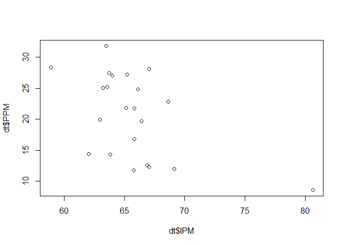<!-- -->

Hubungan antara peubah IPM dan PPM cenderung tidak linear, ada satu
amatan dengan nilai X jauh dari amatan lainnya

### RLS

``` r
plot(dt$RLS, dt$PPM)
```

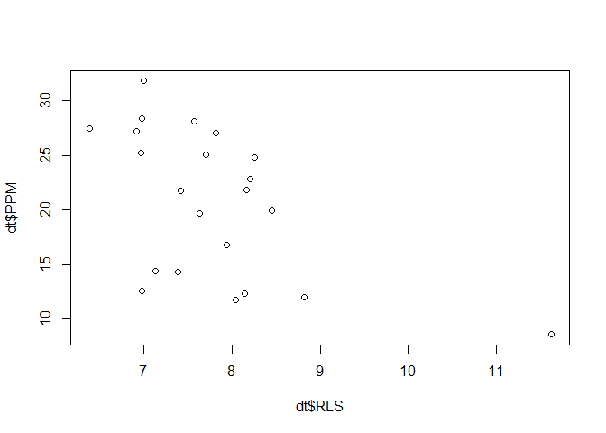<!-- -->

Hubungan antara peubah RLS dan PPM cenderung tidak linear, ada satu
amatan dengan nilai X jauh dari amatan lainnya. Jika amatan tersebut
disisihkan, hubungan linearitas akan lebih terlihat.

### TPT

``` r
plot(dt$PBH, dt$PPM)
```

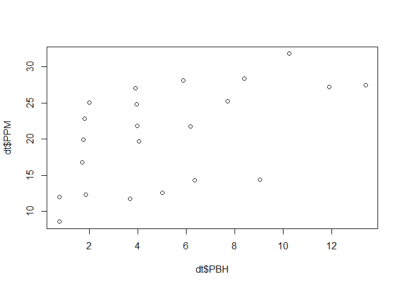<!-- -->

Hubungan linearitas tampak antara peubah PBH dan PPM, tidak ada amatan
dengan nilai yang jauh dari amatan lainnya

### PDRB

``` r
plot(dt$PDRB, dt$PPM)
```

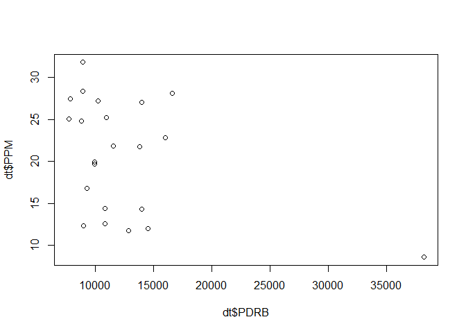<!-- -->

Hubungan antara peubah PDRB dan PPM cenderung tidak linear, ada satu
amatan dengan nilai X jauh dari amatan lainnya.

# PKB

``` r
plot(dt$PKB, dt$PPM)
```

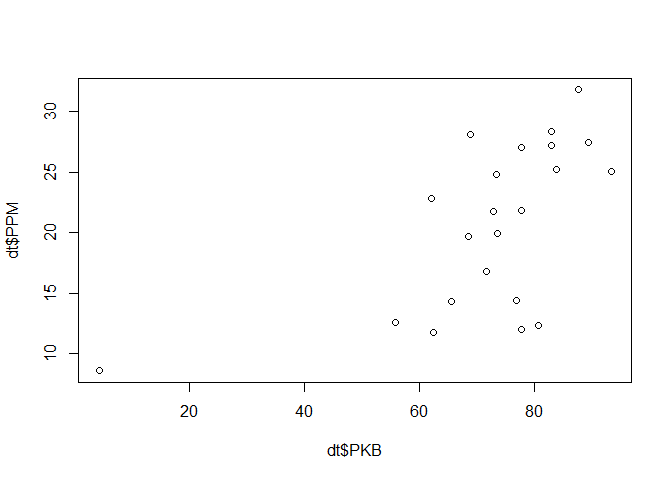<!-- -->

Hubungan antara peubah PKB dan PPM cenderung tidak linear, ada satu
amatan dengan nilai X jauh dari amatan lainnya. Jika amatan tersebut
disisihkan, hubungan linearitas akan lebih terlihat.

## Korelasi

``` r
ggpairs(dt,
        upper = list(continuous = wrap('cor', size = 3)),
        title = "Matriks Scatterplot Data")
```

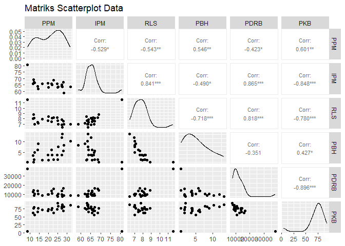<!-- -->

``` r
cor_matrix <- cor(dt, use = "complete.obs")

corrplot(cor_matrix, method = "color", type = "lower",
         col = colorRampPalette(c("red", "white", "blue"))(200),
         addCoef.col = "black", tl.col = "black", tl.srt = 35)
```

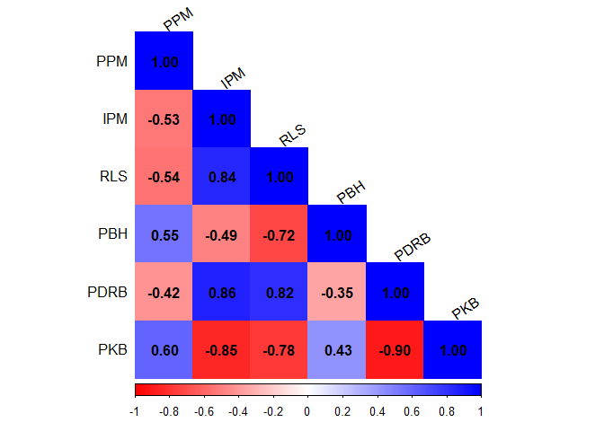<!-- -->

Hasil matriks scatter plot dan korelasi menunjukkan bahwa peubah respon
PPM memiliki hubungan positif dengan PBH dan PKB, serta hubungan negatif
dengan IPM, RLS, dan PDRB. Semua peubah ini secara signifikan memiliki
korelasi dengan PPM.

Selain itu, terdapat korelasi tinggi antar peubah penjelas, baik lebih
dari 0.5 maupun kurang dari -0.5. Beberapa di antaranya adalah:  
1. RLS dan IPM memiliki korelasi 0.84.  
2. PDRB dengan IPM dan RLS masing-masing sebesar 0.86 dan 0.82.  
3. PKB dengan IPM dan PDRB menunjukkan korelasi negatif yang cukup kuat,
yaitu -0.85 dan -0.9.  

Korelasi yang tinggi ini mengindikasikan adanya potensi
multikolinearitas, yang dapat mempengaruhi keakuratan model yang akan
dibentuk.

# Pemodelan

``` r
model1 = lm(formula = PPM ~ ., data = dt)
summary(model1)
```

    ## 
    ## Call:
    ## lm(formula = PPM ~ ., data = dt)
    ## 
    ## Residuals:
    ##     Min      1Q  Median      3Q     Max 
    ## -9.7659 -1.0023  0.5412  2.8937  7.1515 
    ## 
    ## Coefficients:
    ##               Estimate Std. Error t value Pr(>|t|)  
    ## (Intercept)  2.8565725 46.9367713   0.061   0.9522  
    ## IPM         -0.2622032  0.6752097  -0.388   0.7029  
    ## RLS         -0.1350096  3.3558361  -0.040   0.9684  
    ## PBH          0.5494989  0.5827267   0.943   0.3597  
    ## PDRB         0.0006863  0.0005706   1.203   0.2465  
    ## PKB          0.3412797  0.1594600   2.140   0.0481 *
    ## ---
    ## Signif. codes:  0 '***' 0.001 '**' 0.01 '*' 0.05 '.' 0.1 ' ' 1
    ## 
    ## Residual standard error: 5.338 on 16 degrees of freedom
    ## Multiple R-squared:  0.5256, Adjusted R-squared:  0.3773 
    ## F-statistic: 3.545 on 5 and 16 DF,  p-value: 0.02392

Persamaan yang terbentuk adalah


Pada ringkasan model ini dapat dilihat bahwa secara simultan minimal ada
satu peubah penjelas yang berpengaruh signifikan terhadap PPM. Hal
tersebut selaras karena terdapat dugaan parameter yang signifikan pada
taraf nyata 5%, yaitu peubah PKB. Peubah PDRB mengalami perubahan tanda
dalam dugaan parameternya jika dibandingkan dengan arah korelasi,
sehingga mengindikasi ada permasalahan dalam model. Selanjutnya
diperlukan pengujian asumsi pada model, dimulai dengan pemeriksaan
multikolinearitas dilanjutkan dengan diagnosis sisaan

# Pemeriksaan Multikolinearitas

## Perubahan Peubah

``` r
mod1 <- lm(PPM ~ ., dt[1:2])
mod2 <- lm(PPM ~ ., dt[1:3])
mod3 <- lm(PPM ~ ., dt[1:4])
mod4 <- lm(PPM ~ ., dt[1:5])
mod5 <- lm(PPM ~ ., dt)

stargazer(mod1, mod2, mod3, mod4, mod5,
          type = "text", single.row = TRUE)
```

    ## 
    ## ===========================================================================================================================
    ##                                                               Dependent variable:                                          
    ##                     -------------------------------------------------------------------------------------------------------
    ##                                                                       PPM                                                  
    ##                             (1)                  (2)                  (3)                  (4)                 (5)         
    ## ---------------------------------------------------------------------------------------------------------------------------
    ## IPM                   -0.886** (0.318)      -0.414 (0.589)       -0.687 (0.598)      -0.662 (0.714)       -0.262 (0.675)   
    ## RLS                                         -2.160 (2.269)       0.661 (2.884)        0.811 (3.660)       -0.135 (3.356)   
    ## PBH                                                              0.781 (0.517)        0.804 (0.628)       0.549 (0.583)    
    ## PDRB                                                                                -0.00004 (0.001)      0.001 (0.001)    
    ## PKB                                                                                                      0.341** (0.159)   
    ## Constant             78.863*** (20.939)   64.708** (25.724)    56.565** (25.479)     54.044 (44.436)      2.857 (46.937)   
    ## ---------------------------------------------------------------------------------------------------------------------------
    ## Observations                 22                   22                   22                  22                   22         
    ## R2                         0.280                0.312                0.390                0.390               0.526        
    ## Adjusted R2                0.244                0.240                0.288                0.246               0.377        
    ## Residual Std. Error   5.883 (df = 20)      5.897 (df = 19)      5.708 (df = 18)      5.873 (df = 17)     5.338 (df = 16)   
    ## F Statistic         7.761** (df = 1; 20) 4.315** (df = 2; 19) 3.829** (df = 3; 18) 2.714* (df = 4; 17) 3.545** (df = 5; 16)
    ## ===========================================================================================================================
    ## Note:                                                                                           *p<0.1; **p<0.05; ***p<0.01

Terdapat perubahan tanda arah korelasi pada peubah RLS dan PDRB,
perubahan dugaan parameter juga cukup besar ketika ditambahkan peubah
lainnya. Hasil ini mengindikasi adanya permasalahan dalam model.

## Perubahan Banyak Data

``` r
mod5_1 <- lm(PPM ~ ., dt[1:15,])
stargazer(summary(mod5)$coefficients, summary(mod5_1)$coefficients,
          type = "text",
          font.size = "small")
```

    ## 
    ## ===================================================
    ##             Estimate Std. Error t value Pr(> | t| )
    ## ---------------------------------------------------
    ## (Intercept)  2.857     46.937    0.061     0.952   
    ## IPM          -0.262    0.675    -0.388     0.703   
    ## RLS          -0.135    3.356    -0.040     0.968   
    ## PBH          0.549     0.583     0.943     0.360   
    ## PDRB         0.001     0.001     1.203     0.247   
    ## PKB          0.341     0.159     2.140     0.048   
    ## ---------------------------------------------------
    ## 
    ## ===================================================
    ##             Estimate Std. Error t value Pr(> | t| )
    ## ---------------------------------------------------
    ## (Intercept)  -1.836    73.587   -0.025     0.981   
    ## IPM          -0.118    1.018    -0.116     0.910   
    ## RLS          -0.415    5.861    -0.071     0.945   
    ## PBH          0.519     1.217     0.426     0.680   
    ## PDRB         0.0005    0.001     0.720     0.490   
    ## PKB          0.351     0.254     1.380     0.201   
    ## ---------------------------------------------------

Terdapat dugaan parameter yang mengalami perubahan besar ketika jumlah
amatan berbeda, mengindikasi model bermasalah.

## Akar Ciri

``` r
x <- dt[-1]
r <- cor(x)
(ev <- eigen(r)$values)
```

    ## [1] 3.86791372 0.78926897 0.15660599 0.12986654 0.05634478

``` r
# Simultan
if ((max(ev) / min(ev)) <= 100) {
  cat("Tidak ada multikolinearitas\n")
} else if ((max(ev) / min(ev)) > 100 & (max(ev) / min(ev)) <= 1000) {
  cat("Ada multikolinearitas yang lemah\n")
} else {
  cat("Ada multikolinearitas yang kuat\n")
}
```

    ## Tidak ada multikolinearitas

``` r
# Parsial
if (all((max(ev) / ev) <= 1000)) {
  cat("Tidak ada multikolinearitas\n")
} else {
  cat("Ada multikolinearitas pada peubah penjelas ke:", which((max(ev) / ev) > 1000), "\n")
}
```

    ## Tidak ada multikolinearitas

## Nilai VIF

``` r
vif(model1)
```

    ##      IPM      RLS      PBH     PDRB      PKB 
    ## 5.473411 9.117351 3.290663 9.519787 5.957858

Hasil pemeriksaan dengan akar ciri menyatakan tidak ada
multikolinearitas pada model karena tidak ada nilai
 secara
simultan. Nilai VIF juga menunjukkan tidak ada peubah yang VIF nya lebih
dari 10, tetapi peubah PDRB memiliki nilai VIF yang mendekati 10
sehingga sangat berpotensi adanya hubungan linear yang kuat antara PDRB
dengan peubah penjelas lainnya. Pada analisis kali ini, penanganan
dilakukan dengan menghapus peubah bernilai VIF tinggi yaitu RLS karena
merupakan unsur pembangun IPM.

# Pemodelan Penyisihan Peubah

``` r
model2 <- lm(PPM ~ IPM + PBH + PDRB + PKB, data = dt)
summary(model2)
```

    ## 
    ## Call:
    ## lm(formula = PPM ~ IPM + PBH + PDRB + PKB, data = dt)
    ## 
    ## Residuals:
    ##     Min      1Q  Median      3Q     Max 
    ## -9.7905 -0.9878  0.5303  2.8854  7.0689 
    ## 
    ## Coefficients:
    ##               Estimate Std. Error t value Pr(>|t|)  
    ## (Intercept)  2.4478478 44.4581508   0.055   0.9567  
    ## IPM         -0.2701044  0.6267602  -0.431   0.6719  
    ## PBH          0.5673230  0.3672478   1.545   0.1408  
    ## PDRB         0.0006738  0.0004638   1.453   0.1645  
    ## PKB          0.3404346  0.1533585   2.220   0.0403 *
    ## ---
    ## Signif. codes:  0 '***' 0.001 '**' 0.01 '*' 0.05 '.' 0.1 ' ' 1
    ## 
    ## Residual standard error: 5.179 on 17 degrees of freedom
    ## Multiple R-squared:  0.5255, Adjusted R-squared:  0.4139 
    ## F-statistic: 4.707 on 4 and 17 DF,  p-value: 0.009674

Persamaan yang terbentuk adalah


Pada ringkasan model ini dapat dilihat bahwa secara simultan minimal ada
satu peubah penjelas yang berpengaruh signifikan terhadap PPM. Hal
tersebut selaras karena terdapat dugaan parameter yang signifikan pada
taraf nyata 5%, yaitu peubah PKB. Peubah PDRB mengalami perubahan tanda
dalam dugaan parameternya jika dibandingkan dengan arah korelasi,
sehingga mengindikasi ada permasalahan dalam model.

## Nilai VIF

``` r
vif(model2)
```

    ##      IPM      PBH     PDRB      PKB 
    ## 5.010355 1.388535 6.682993 5.854468

Model hasil reduksi peubah menunjukkan bahwa nilai VIF \< 10 sehingga
dinyatakan tidak terjadi multikolinearitas. Namun masih ada peubah yang
mengalami perubahan tanda arah korelasi. Artinya ada permasalahan lain
yang mungkin belum tertangani, perlu dilakuan uji asumsi dan pemeriksaan
pencilan, leverage, dan amatan berpengaruh

# Pengujian Asumsi

## Eksplorasi Grafik

### Plot Sisaan vs Y duga

``` r
plot(model2,1) 
```

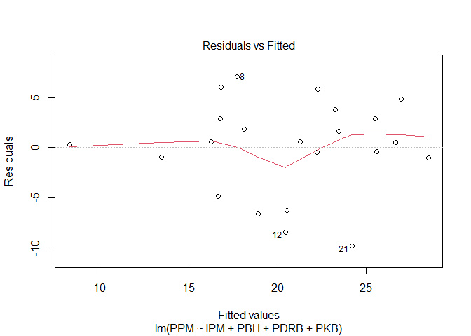<!-- -->

1.  Sisaan di sekitar 0 → Nilai harapan sisaan sama dengan nol  
2.  Lebar pita tidak sama untuk setiap nilai dugaan → ragam sisaan tidak
    homogen  
3.  Pola plot cenderung berbentuk corong → ragam sisaan tidak homogen  

### Plot Sisaan vs Urutan

``` r
plot(x = 1:dim(dt)[1],
     y = model2$residuals,
     type = 'b', 
     ylab = "Residuals",
     xlab = "Observation")
```

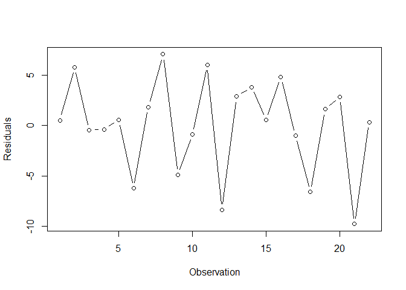<!-- -->

Tebaran tidak berpola → sisaan saling bebas, model pas, tetapi ada
indikasi terdapat autokorelasi karena hampir menyerupai pola
autokorelasi negatif

### QQ plot

``` r
plot(model2,2)
```

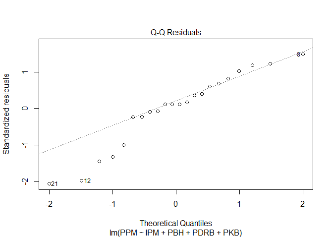<!-- -->

Amatan cenderung tidak mengikuti garis pola sehingga sisaan tidak
menyebar normal

## Uji Formal

### Nilai harapan sisaan sama dengan nol

``` r
t.test(model2$residuals,mu = 0,conf.level = 0.95)
```

    ## 
    ##  One Sample t-test
    ## 
    ## data:  model2$residuals
    ## t = -1.4737e-16, df = 21, p-value = 1
    ## alternative hypothesis: true mean is not equal to 0
    ## 95 percent confidence interval:
    ##  -2.065887  2.065887
    ## sample estimates:
    ##     mean of x 
    ## -1.463981e-16

Nilai p pada uji t sama dengan 1 yang lebih besar dari alpha 5%,
sehingga dinyatakan asumsi nilai harapan sisaan sama dengan nol
terpenuhi

### Ragam sisaan homogen

``` r
bptest(model2)
```

    ## 
    ##  studentized Breusch-Pagan test
    ## 
    ## data:  model2
    ## BP = 0.58204, df = 4, p-value = 0.965

Nilai p pada uji breusch pagan sama dengan 0.965 yang lebih besar dari
alpha 5%, sehingga dinyatakan asumsi ragam sisaan homogen terpenuhi

### Sisaan saling bebas

``` r
dwtest(model2)
```

    ## 
    ##  Durbin-Watson test
    ## 
    ## data:  model2
    ## DW = 2.5773, p-value = 0.8634
    ## alternative hypothesis: true autocorrelation is greater than 0

Nilai p pada uji durbin watson sama dengan 0.863 yang lebih besar dari
alpha 5%, sehingga dinyatakan asumsi sisaan saling bebas terpenuhi

### Normalitas Sisaan

``` r
shapiro.test(model2$residuals)
```

    ## 
    ##  Shapiro-Wilk normality test
    ## 
    ## data:  model2$residuals
    ## W = 0.93934, p-value = 0.1918

Nilai p pada uji shapiro wilk sama dengan 0.1918 yang lebih besar dari
alpha 5%, sehingga dinyatakan asumsi normalitas sisaan terpenuhi

Semua asumsi sisaan terpenuhi, tetapi model masih buruk, kemungkinan
karena keberadaan amatan yang tidak biasa seperti pencilan, leverage,
atau amatan berpengaruh

# Pemeriksaan Amatan Tidak Biasa

``` r
#fungsi
ri_stud <- rstudent(model2)
ri_stan <- rstandard(model2)
hii_fungsi <- hatvalues(model2)

#manual
X <- model.matrix(model2)
X_inv_xt <- X %*% solve(t(X) %*% X) %*% t(X)
hii_manual <- diag(X_inv_xt)
anova_model <- anova(model2)
s <- sqrt(anova_model["Residuals", "Mean Sq"])
ei <- model2$residuals
ri_manual <- ei/(s*sqrt(1-hii_manual))

nilai <- data.frame(ri_stud, ri_stan, ri_manual, hii_fungsi, hii_manual)
nilai
```

    ##        ri_stud     ri_stan   ri_manual hii_fungsi hii_manual
    ## 1   0.11429427  0.11776377  0.11776377 0.29134182 0.29134182
    ## 2   1.20000664  1.18477170  1.18477170 0.10725154 0.10725154
    ## 3  -0.08914518 -0.09186594 -0.09186594 0.06227851 0.06227851
    ## 4  -0.07670980 -0.07905611 -0.07905611 0.10379160 0.10379160
    ## 5   0.10734759  0.11061154  0.11061154 0.06734526 0.06734526
    ## 6  -1.35454895 -1.32246750 -1.32246750 0.16788825 0.16788825
    ## 7   0.38709052  0.39714847  0.39714847 0.20822933 0.20822933
    ## 8   1.54360154  1.48441368  1.48441368 0.15441758 0.15441758
    ## 9  -1.00511609 -1.00481297 -1.00481297 0.12009852 0.12009852
    ## 10 -0.22191867 -0.22839729 -0.22839729 0.40011312 0.40011312
    ## 11  1.24132965  1.22204067  1.22204067 0.09197298 0.09197298
    ## 12 -2.18465656 -1.97633656 -1.97633656 0.32887734 0.32887734
    ## 13  0.59546819  0.60710429  0.60710429 0.15326256 0.15326256
    ## 14  0.81591801  0.82406015  0.82406015 0.20071691 0.20071691
    ## 15  0.11213518  0.11554091  0.11554091 0.16358295 0.16358295
    ## 16  1.01780949  1.01673542  1.01673542 0.16363446 0.16363446
    ## 17 -0.23946702 -0.24639580 -0.24639580 0.37131363 0.37131363
    ## 18 -1.49375276 -1.44242883 -1.44242883 0.22069195 0.22069195
    ## 19  0.35292484  0.36237882  0.36237882 0.25496369 0.25496369
    ## 20  0.67504148  0.68611512  0.68611512 0.35106892 0.35106892
    ## 21 -2.31460886 -2.06503652 -2.06503652 0.16187030 0.16187030
    ## 22  0.16144806  0.16628146  0.16628146 0.85528879 0.85528879

## Pencilan

``` r
for (i in 1:dim(nilai)[1]){
  absri <- abs(nilai[,2])
  pencilan <- which(absri > 2)
}
pencilan
```

    ## [1] 21

Amatan ke-21 terdeteksi sebagai pencilan

## Leverage

``` r
n <- dim(dt)[1]
p <- length(model2$coefficients)

for (i in 1:dim(nilai)[1]){
  cutoff <- 2*p/n
  titik_leverage <- which(hii_fungsi > cutoff)
}
titik_leverage
```

    ## 22 
    ## 22

Amatan ke-22 terdeteksi sebagai titik leverage

``` r
ols_plot_resid_lev(model2)
```

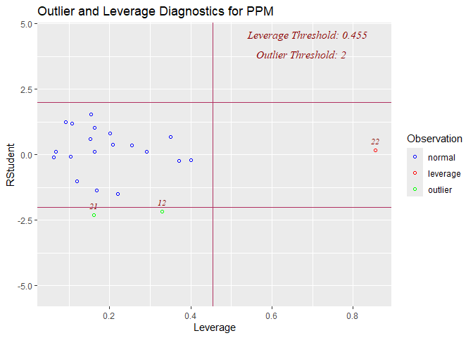<!-- -->

Plot yang terbentuk dari fungsi `ols_plot_resid_lev()` menyatakan bahwa
amatan ke-12 juga termasuk sebagai pencilan/outlier. Hal ini dikarenakan
perbedaan rumusan yang dipakai pada `rstandard()` dan `rstudent()`. Jika
diperhatikan dengan seksama, nilai rii menggunakan fungsi `rstandard()`
pada amatan ke-12 mencapai nilai 1.96 yang memang dekat dengan 2
sehingga dapat dijadikan perhatian juga

## Amatan Berpengaruh

### Jarak Cook

``` r
di <- cooks.distance(model2)
f <- qf(0.05,p,n-p, lower.tail = F)
data.frame(di, di>f)
```

    ##              di di...f
    ## 1  0.0011403008  FALSE
    ## 2  0.0337266923  FALSE
    ## 3  0.0001120994  FALSE
    ## 4  0.0001447618  FALSE
    ## 5  0.0001766921  FALSE
    ## 6  0.0705730111  FALSE
    ## 7  0.0082961823  FALSE
    ## 8  0.0804786488  FALSE
    ## 9  0.0275615771  FALSE
    ## 10 0.0069586555  FALSE
    ## 11 0.0302526055  FALSE
    ## 12 0.3828105120  FALSE
    ## 13 0.0133427061  FALSE
    ## 14 0.0341060299  FALSE
    ## 15 0.0005221758  FALSE
    ## 16 0.0404505599  FALSE
    ## 17 0.0071713916  FALSE
    ## 18 0.1178409150  FALSE
    ## 19 0.0089878643  FALSE
    ## 20 0.0509351724  FALSE
    ## 21 0.1647181301  FALSE
    ## 22 0.0326834768  FALSE

``` r
cooks_crit = f
model_cooks <- cooks.distance(model2)
df <- data.frame(obs = names(model_cooks),
                 cooks = model_cooks)
ggplot(df, aes(y = cooks, x = obs)) +
  geom_point() +
  geom_hline(yintercept = cooks_crit, linetype="dashed") +
  labs(title = "Cook's Distance",
       subtitle = "Influential Observation ",
       x = "Observation Number",
       y = "Cook's")
```

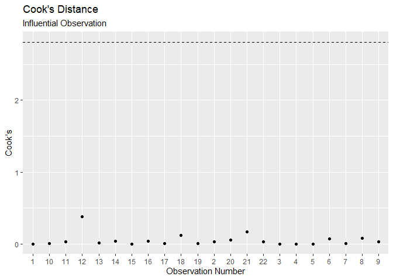<!-- -->

Pemeriksaan amatan berpengaruh dengan jarak cook tidak dihasilkan nilai
yang melebihi ambang batas

### DFBETAS

``` r
ols_plot_dfbetas(model2)
```

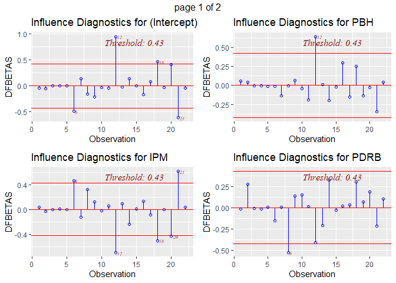<!-- -->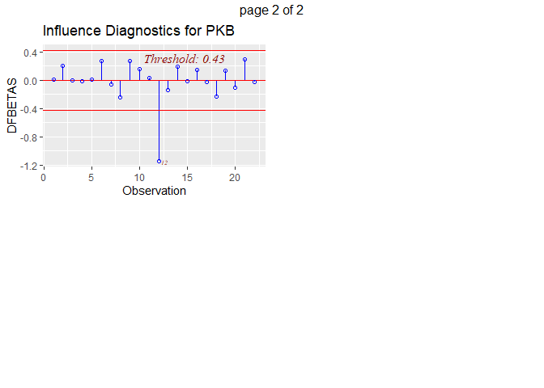<!-- -->

Hasil DFBETAS akan menunjukkan pengaruh observasi terhadap setiap
koefisien regresi, sehingga ada output untuk setiap parameter regresi.
DFBETAS mengukur seberapa besar koefisien regresi berubah jika suatu
observasi dihapus dari model.

### DFFITS

``` r
ols_plot_dffits(model2)
```

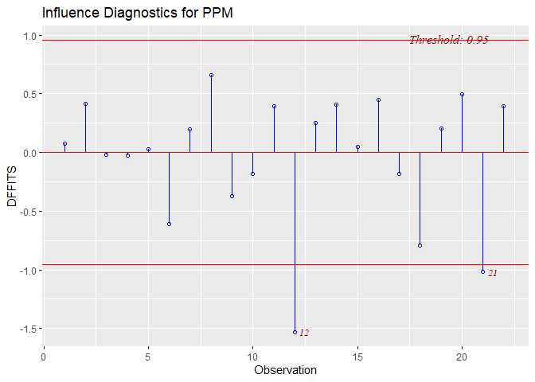<!-- -->

Hasil DFFITS menunjukkan pengaruh observasi terhadap nilai prediksi Y,
sehingga hanya menghasilkan satu output. DFFITS mengukur seberapa besar
nilai prediksi

berubah jika suatu observasi dihapus dari model, sehingga lebih tepat
digunakan jika ingin melihat pengaruh observasi terhadap hasil model
secara keseluruhan

``` r
DFFITSi <- dffits(model2)

amatan_berpengaruh <- vector("list", dim(nilai)[1])
for (i in 1:dim(nilai)[1]) {
  cutoff <- 2 * sqrt((p / n))
  amatan_berpengaruh[[i]] <- which(abs(DFFITSi) > cutoff)
}
berpengaruh <- unlist(amatan_berpengaruh)
amatan_berpengaruh <- sort(unique(berpengaruh))
amatan_berpengaruh
```

    ## [1] 12 21

Amatan ke-12 dan 21 termasuk amatan berpengaruh sehingga sangat riskan
jika disisihkan. Perlu ditelusuri lebih lanjut

# Pemodelan Penyisihan Amatan

``` r
# gunakan peubah penjelas yang sudah diseleksi

dt1 <- dt %>% slice(-12)
model3 <- lm(PPM ~ IPM + PBH + PDRB + PKB, dt1)

dt2 <- dt %>% slice(-21)
model4 <- lm(PPM ~ IPM + PBH + PDRB + PKB, dt2)

dt3 <- dt %>% slice(-22)
model5 <- lm(PPM ~ IPM + PBH + PDRB + PKB, dt3)

dt4 <- dt %>% slice(-c(12, 21))
model6 <- lm(PPM ~ IPM + PBH + PDRB + PKB, dt4)

dt5 <- dt %>% slice(-c(12, 22))
model7 <- lm(PPM ~ IPM + PBH + PDRB + PKB, dt5)

dt6 <- dt %>% slice(-c(21, 22))
model8 <- lm(PPM ~ IPM + PBH + PDRB + PKB, dt6)

dt7 <- dt %>% slice(-c(12, 21, 22))
model9 <- lm(PPM ~ IPM + PBH + PDRB + PKB, dt7)
```

``` r
get_metrics <- function(model) {
  adj_r2 <- summary(model)$adj.r.squared
  sse <- sum(model$residuals^2)
  return(c(adj_r2, sse))
}

model_metrics <- data.frame(
  Model = c("Model 2", "Model 3", "Model 4", "Model 5", "Model 6",
            "Model 7", "Model 8", "Model 9"),
  Adjusted_R2 = sapply(list(model2, model3, model4, model5, 
                            model6, model7, model8, model9), 
                       function(m) get_metrics(m)[1]),
  SSE = sapply(list(model2, model3, model4, model5, 
                    model6, model7, model8, model9), 
               function(m) get_metrics(m)[2])
)

print(model_metrics)
```

    ##     Model Adjusted_R2      SSE
    ## 1 Model 2   0.4138765 455.9213
    ## 2 Model 3   0.5033542 351.1692
    ## 3 Model 4   0.5361413 341.5554
    ## 4 Model 5   0.2970396 455.1798
    ## 5 Model 6   0.6025057 262.9080
    ## 6 Model 7   0.3898263 347.5751
    ## 7 Model 8   0.4337186 340.2260
    ## 8 Model 9   0.4958369 261.2673

Berdasarkan hasil perbandingan tersebut, didapatkan bahwa model 4 yang
menyisihkan amatan ke-21 memiliki nilai adjusted R square terbesar
tetapi bukan SSE yang terkecil. SSE terkecil terdapat pada model 9 yang
menyisihkan amatan ke-12, 21, dan 22

``` r
stargazer(model2, model4, model9, type = "text", font.size = "small",
          report = "vc*p")
```

    ## 
    ## =====================================================================================
    ##                                            Dependent variable:                       
    ##                     -----------------------------------------------------------------
    ##                                                    PPM                               
    ##                              (1)                   (2)                   (3)         
    ## -------------------------------------------------------------------------------------
    ## IPM                        -0.270                -0.614                -0.178        
    ##                           p = 0.672             p = 0.305             p = 0.771      
    ##                                                                                      
    ## PBH                         0.567                0.680*                 0.495        
    ##                           p = 0.141             p = 0.057             p = 0.154      
    ##                                                                                      
    ## PDRB                        0.001                0.001*                0.001*        
    ##                           p = 0.165             p = 0.086             p = 0.060      
    ##                                                                                      
    ## PKB                        0.340**               0.301**              0.444***       
    ##                           p = 0.041             p = 0.045             p = 0.010      
    ##                                                                                      
    ## Constant                    2.448                26.745                -13.457       
    ##                           p = 0.957             p = 0.524             p = 0.767      
    ##                                                                                      
    ## -------------------------------------------------------------------------------------
    ## Observations                 22                    21                    19          
    ## R2                          0.526                 0.629                 0.608        
    ## Adjusted R2                 0.414                 0.536                 0.496        
    ## Residual Std. Error    5.179 (df = 17)       4.620 (df = 16)       4.320 (df = 14)   
    ## F Statistic         4.707*** (df = 4; 17) 6.779*** (df = 4; 16) 5.426*** (df = 4; 14)
    ## =====================================================================================
    ## Note:                                                     *p<0.1; **p<0.05; ***p<0.01
