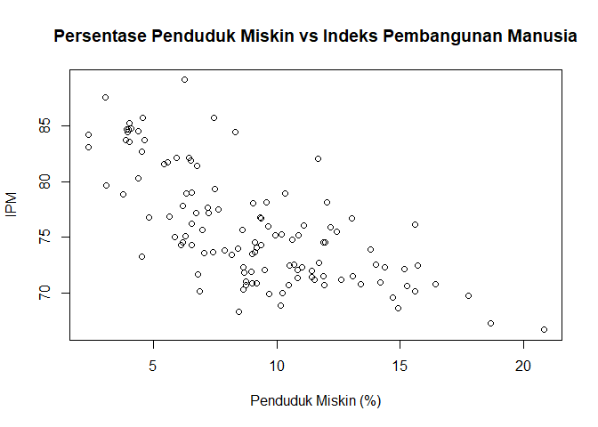

Praktikum 2 Anreg
================
Muhammad Khayruhanif
2026-02-09

- [Data](#data)
  - [Membaca Data](#membaca-data)
  - [Menyesuaikan Peubah](#menyesuaikan-peubah)
- [Eksplorasi Data](#eksplorasi-data)
- [Pembentukan Model](#pembentukan-model)
  - [Manual](#manual)
    - [Koefisien Regresi](#koefisien-regresi)
    - [Standar Error Parameter
      Regresi](#standar-error-parameter-regresi)
    - [Signifikansi Parameter
      (nilai-t)](#signifikansi-parameter-nilai-t)
    - [Koefisien Determinasi dan
      Penyesuaiannya](#koefisien-determinasi-dan-penyesuaiannya)
    - [Signifikansi Simultan (F)](#signifikansi-simultan-f)
  - [Menggunakan Fungsi `lm()`](#menggunakan-fungsi-lm)
- [Kesimpulan](#kesimpulan)

# Data

## Membaca Data

data Jika data berupa csv, maka tidak perlu pemanggilan
`library(readxl)` karena R sudah memiliki fungsi bawaan terhadap hal
tersebut. Apabila file .csv pada software excel ditunjukkan dengan
delimiter “,” maka dapat menggunakan fungsi `read.csv`, apabila
delimiter berupa “;” maka dapat menggunakan fungsi `read.csv2`.

``` r
library(readxl)
```

    ## Warning: package 'readxl' was built under R version 4.5.2

``` r
data <- read_excel("C:\\Users\\ASUS\\Downloads\\NSC-2025.xlsx", sheet="Sheet2")
head(data) #menampilkan sebagian data awal
```

    ## # A tibble: 6 × 11
    ##   `Kabupaten/Kota`     `Indeks Pembangunan Manusia` `Rata-Rata Lama Sekolah`
    ##   <chr>                                       <dbl>                    <dbl>
    ## 1 Kepulauan Seribu                             76.7                     9.26
    ## 2 Kota Jakarta Selatan                         87.6                    12.0 
    ## 3 Kota Jakarta Timur                           84.8                    12.0 
    ## 4 Kota Jakarta Pusat                           83.8                    11.6 
    ## 5 Kota Jakarta Barat                           84.4                    11.2 
    ## 6 Kota Jakarta Utara                           82.1                    10.8 
    ## # ℹ 8 more variables: `PDRB ADHK (MILYAR RUPIAH)` <dbl>,
    ## #   `Persentase Penduduk Miskin` <dbl>,
    ## #   `Persentase Akses Sanitasi Layak` <dbl>,
    ## #   `Kontribusi Sektor Industri Pengolahan teradap PDRB/PDB  (%)` <dbl>,
    ## #   `Pertumbuhan Ekonomi Sektor Industri Pengolahan` <dbl>,
    ## #   `Indeks Pembangunan Gender` <dbl>,
    ## #   `Tingkat Partisipasi Angkatan Kerja (TPAK)` <dbl>, …

## Menyesuaikan Peubah

Untuk mempermudah pemanggilan peubah pada saat eksplorasi dan analisis,
jika pada file masih mengggunakan nama peubah yang panjang, maka bisa
diganti dengan menggunakan fungsi `colnames()`. Kolom wilayah juga dapat
dihapus dengan menggunakan syntax `namadata[,-1]` dengan -1 menunjukkan
bahwa kolom pertama ingin dihapus.

``` r
colnames(data) <- c("Kabupaten/Kota", "Y", paste0("X", 1:9))
head(data)
```

    ## # A tibble: 6 × 11
    ##   `Kabupaten/Kota`      Y    X1     X2    X3    X4    X5    X6    X7    X8    X9
    ##   <chr>             <dbl> <dbl>  <dbl> <dbl> <dbl> <dbl> <dbl> <dbl> <dbl> <dbl>
    ## 1 Kepulauan Seribu   76.7  9.26 3.27e3 13.0   89.1  4.06  0.37  93.6  72.6  7.93
    ## 2 Kota Jakarta Sel…  87.6 12.0  5.00e5  3.03  92.6  1.38  3.74  97.3  64.8  5.22
    ## 3 Kota Jakarta Tim…  84.8 12.0  3.62e5  4.09  97.2 26.7   2.13  95.9  64.5  6.95
    ## 4 Kota Jakarta Pus…  83.8 11.6  5.33e5  4.63  90.3  0.84  0.01  96.2  65.1  6.24
    ## 5 Kota Jakarta Bar…  84.4 11.2  3.83e5  3.94  94.9  5.3   2.16  95.7  64.1  6.18
    ## 6 Kota Jakarta Uta…  82.1 10.8  3.80e5  6.44  91.4 30.3   0.52  94.4  67.8  6.18

# Eksplorasi Data

``` r
n <- nrow(data)
```

Saat ini terdapat 1 peubah Y dan 9 peubah X, misal ingin dilakukan
eksplorasi dan analisis terkait peubah X1

``` r
plot(data$X3, data$Y,
     main = "Persentase Penduduk Miskin vs Indeks Pembangunan Manusia",
     xlab = "Penduduk Miskin (%)",
     ylab = "IPM")
```

<!-- -->

``` r
summary(data$Y)
```

    ##    Min. 1st Qu.  Median    Mean 3rd Qu.    Max. 
    ##   66.72   71.91   74.57   75.75   78.86   89.10

``` r
boxplot(data$Y)
```

<!-- -->

``` r
summary(data$X3)
```

    ##    Min. 1st Qu.  Median    Mean 3rd Qu.    Max. 
    ##   2.340   6.380   8.980   9.074  11.425  20.830

``` r
boxplot(data$X3)
```

<!-- -->

# Pembentukan Model

## Manual

### Koefisien Regresi

$\hat{y_i} = \hat{\beta_0} + \hat{\beta_1} x_{i}, i = 1,2, ..., n$
$\hat{\beta_1} = \frac{\sum(y_i - \bar{y}) - \sum(x_i - \bar{x})}{\sum(x_i - \bar{x})^2} = \frac{S_{xx}{S_{xy} atau$
$\hat{\beta_1} = \frac{\sum (x_iy)-\frac{\sum(x_i)\sum(y)}{n}}{\sum(x_i^2)-\frac{\sum(x_i^2)}{n}}$
$\hat{\beta_0} = \bar{y} - \hat{\beta_1} \bar{x}$

``` r
x <- data$X3
y <- data$Y
```

``` r
b1 <- (sum(x*y)-sum(x)*sum(y)/n)/(sum(x^2)-(sum(x)^2/n))
b0 <- mean(y)-b1*mean(x)

cat("Koefisien b0:", b0, "\n")  
```

    ## Koefisien b0: 84.2552

``` r
cat("Koefisien b1:", b1, "\n")
```

    ## Koefisien b1: -0.9377205

### Standar Error Parameter Regresi

Standar error menunjukan seberapa besar ketidakpastian dalam estimasi
koefisien

``` r
galat <- y-(b0+b1*x)
ragam_galat <- sum(galat^2)/(n-2)

se_b0 <- sqrt(ragam_galat*(1/n+mean(x)^2/sum((x-mean(x))^2)))
se_b1 <- sqrt(ragam_galat/sum((x-mean(x))^2))

cat("Standar error b0:", se_b0, "\n") 
```

    ## Standar error b0: 0.8787893

``` r
cat("Standar error b1:", se_b1, "\n")
```

    ## Standar error b1: 0.08966655

### Signifikansi Parameter (nilai-t)

Nilai ini menunjukkan tingkat signifikansi secara parsial dari setiap
koefisien peubah berdasarkan nilai t dan probabilitas nilai p

``` r
t_b0 <- b0/se_b0
t_b1 <- b1/se_b1
p_b0 <- 2*pt(-abs(t_b0 ),df<-n-2)
p_b1 <- 2*pt(-abs(t_b1 ),df<-n-2)

cat("Nilai t pada b0 adalah", t_b0, "dengan nilai p sebesar", p_b0, "\n")  
```

    ## Nilai t pada b0 adalah 95.87645 dengan nilai p sebesar 4.751831e-113

``` r
cat("Nilai t pada b1 adalah", t_b1, "dengan nilai p sebesar", p_b1, "\n") 
```

    ## Nilai t pada b1 adalah -10.45786 dengan nilai p sebesar 1.792162e-18

Nilai p kurang dari alpha 0.05 untuk b0 maupun b1 sehingga signifikan
pada taraf nyata 5%

### Koefisien Determinasi dan Penyesuaiannya

Pada analisis regresi linier sederhana, koefisien determinasi yang
digunakan adalah multiple R Squared, sedangkan regresi linier berganda
menggunakan adjusted R Squared yang disesuaikan dengan banyaknya peubah

``` r
r <- (sum(x*y)-sum(x)*sum(y)/n)/
sqrt((sum(x^2)-(sum(x)^2/n))*(sum(y^2)-(sum(y)^2/n)))
Koef_det <- r^2
Koef_det
```

    ## [1] 0.48314

``` r
Adj_R2 <- 1-((1-Koef_det)*(n-1)/(n-1-1))
Adj_R2
```

    ## [1] 0.4787224

### Signifikansi Simultan (F)

Nilai ini menunjukkan signifikansi dan kebaikan model secara simultan
(bersamaan seluruh peubah) yang menjelaskan model secara keseluruhan
memiliki hubungan berarti antara X dan Y

``` r
galat<-y-(b0+b1*x)

JKG <- sum((y - (b0+b1*x))^2)
JKReg <- sum(((b0+b1*x)- mean(y))^2)
JKT <- sum((y - mean(y))^2)
JKT <- JKReg+JKG

dbReg <- 1
dbg <- n-2
dbt <- n-1

(Fhit <- (JKReg/dbReg)/(JKG/dbg))
```

    ## [1] 109.3669

``` r
(p_Fhit <- 1-pf(Fhit, dbReg, dbg, lower.tail = F))
```

    ## [1] 1

Nilai p kurang dari alpha 0.05 sehingga secara simultan X dan Y saling
memengaruhi

## Menggunakan Fungsi `lm()`

Dalam penggunaan fungsi `lm()`, kita akan memperoleh secara langsung
nilai-nilai pada pemodelan regresi dari data yang kita miliki. Hanya
dengan mengeluarkan summary dan anova dari model yang terbentuk maka
dapat diperoleh nilai parameter, signifikansinya, standar eror,
koefisien determinasi hingga ukuran keragamannya.

``` r
model <- lm(Y~X3, data = data)
summary(model)
```

    ## 
    ## Call:
    ## lm(formula = Y ~ X3, data = data)
    ## 
    ## Residuals:
    ##     Min      1Q  Median      3Q     Max 
    ## -8.0108 -2.3263  0.0117  2.4857 10.7149 
    ## 
    ## Coefficients:
    ##             Estimate Std. Error t value Pr(>|t|)    
    ## (Intercept) 84.25520    0.87879   95.88   <2e-16 ***
    ## X3          -0.93772    0.08967  -10.46   <2e-16 ***
    ## ---
    ## Signif. codes:  0 '***' 0.001 '**' 0.01 '*' 0.05 '.' 0.1 ' ' 1
    ## 
    ## Residual standard error: 3.622 on 117 degrees of freedom
    ## Multiple R-squared:  0.4831, Adjusted R-squared:  0.4787 
    ## F-statistic: 109.4 on 1 and 117 DF,  p-value: < 2.2e-16

Berdasarkan hasil diperoleh bahwa kedua cara valid dan memberikan hasil
yang sama dalam membuat pemodelan regresi linear sederhana.

``` r
anova(model)
```

    ## Analysis of Variance Table
    ## 
    ## Response: Y
    ##            Df Sum Sq Mean Sq F value    Pr(>F)    
    ## X3          1 1434.7 1434.74  109.37 < 2.2e-16 ***
    ## Residuals 117 1534.9   13.12                      
    ## ---
    ## Signif. codes:  0 '***' 0.001 '**' 0.01 '*' 0.05 '.' 0.1 ' ' 1

# Kesimpulan

Model yang terbentuk adalah sebagai berikut:

$$\hat{Y} = 84.2552 + -0.9377205 X_1$$

dengan Y adalah Indeks Pembangunan Masyarakat dan X3 adalah Persentase Penduduk Miskin.

Didapatkan nilai $\hat\beta_0 = 84.2552$ artinya nilai dugaan rataan
indeks pembangunan manusia ketika Persentase Penduduk Miskin bernilai 0 adalah 84.2552, akan tetapi nilai 0 tidak ada dalam selang
pengamatan Persentase Penduduk Miskin sehingga $\hat\beta_0$ tidak dapat
didefinisikan lebih lanjut

Nilai $\hat\beta_1 = -0.9377205$ artinya nilai dugaan perubahan dugaan
rataan Indeks Pembangunan Manusia jika Persentase Penduduk Miskin berubah
satu bagian adalah sebesar -0.9377205

Koefisien determinasi yang dihasilkan adalah 0.48314 atau 48.314%
artinya keragaman Indeks Pembangunan Manusia yang dapat dijelaskan oleh
Persentase Penduduk Miskin adalah sebesar 48.314%, sisanya yaitu
51.686% dijelaskan oleh peubah lain yang tidak dimasukkan dalam model.

