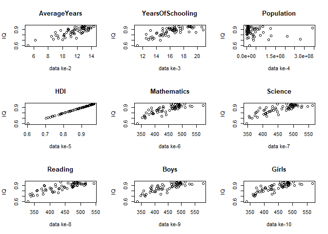
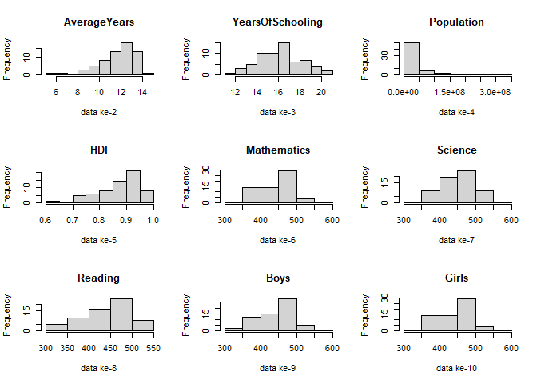
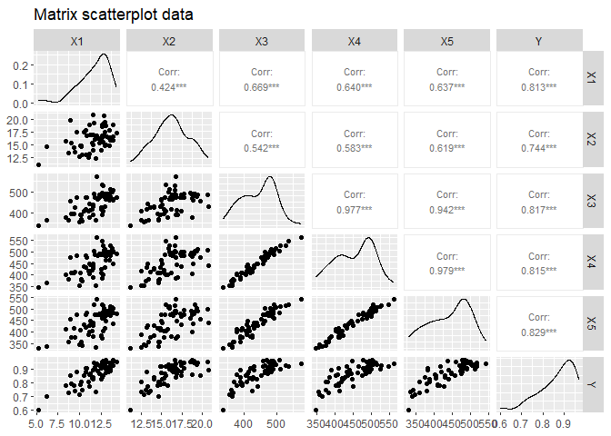
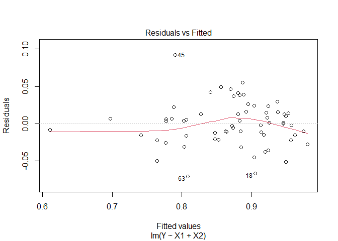
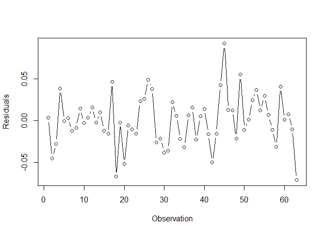
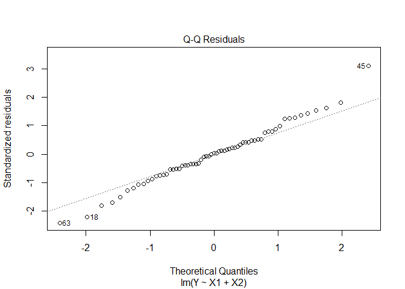
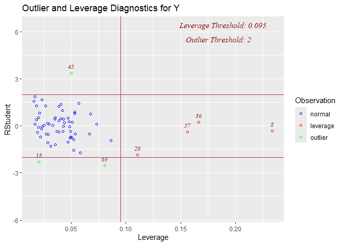
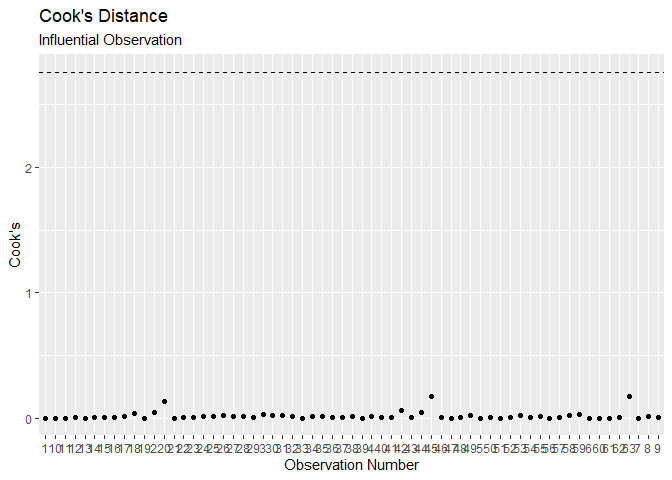
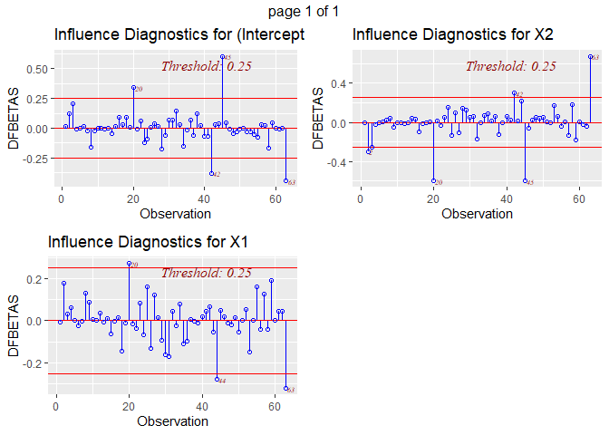
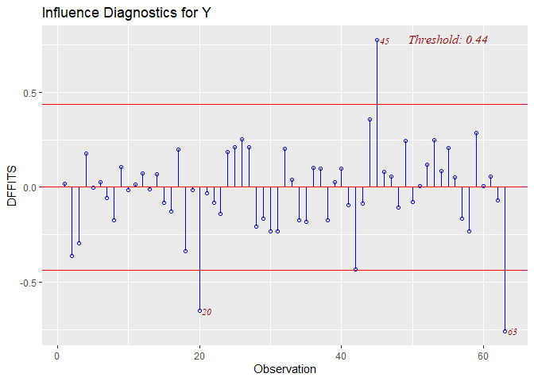

Tugas Mandiri 2 Anreg
================
Muhammad Khayruhanif
2026-03-12

``` r
library(readxl)
```

    ## Warning: package 'readxl' was built under R version 4.5.2

``` r
data <- read_xlsx("C:\\Users\\ASUS\\Downloads\\DATA PENDIDIKAN_ANREG.xlsx", sheet="Data")
head(data)
```

    ## # A tibble: 6 × 11
    ##   Country   AverageYears YearsOfSchooling Population   HDI Mathematics Science
    ##   <chr>            <dbl>            <dbl>      <dbl> <dbl>       <dbl>   <dbl>
    ## 1 Albania          10.2              14.7    2827614 0.806        368.    376.
    ## 2 Argentina        11.2              18.8   45407904 0.858        378.    406.
    ## 3 Australia        12.9              20.7   26200987 0.952        487.    507.
    ## 4 Austria          12.4              16.3    9064678 0.927        487.    491.
    ## 5 Belgium          12.7              19.0   11641814 0.945        489.    491.
    ## 6 Brazil            8.43             15.8  210306411 0.78         379.    403.
    ## # ℹ 4 more variables: Reading <dbl>, Boys <dbl>, Girls <dbl>, IQ <dbl>

``` r
summary(data)
```

    ##    Country           AverageYears    YearsOfSchooling   Population       
    ##  Length:63          Min.   : 5.197   Min.   :11.19    Min.   :   380368  
    ##  Class :character   1st Qu.:10.763   1st Qu.:14.91    1st Qu.:  5294264  
    ##  Mode  :character   Median :12.095   Median :16.28    Median : 10673216  
    ##                     Mean   :11.701   Mean   :16.23    Mean   : 37894707  
    ##                     3rd Qu.:12.971   3rd Qu.:17.49    3rd Qu.: 39935014  
    ##                     Max.   :14.296   Max.   :20.85    Max.   :341534041  
    ##       HDI          Mathematics       Science         Reading     
    ##  Min.   :0.6020   Min.   :336.4   Min.   :347.1   Min.   :328.8  
    ##  1st Qu.:0.8285   1st Qu.:407.1   1st Qu.:410.4   1st Qu.:402.5  
    ##  Median :0.8880   Median :458.9   Median :464.8   Median :456.1  
    ##  Mean   :0.8702   Mean   :445.0   Mean   :454.0   Mean   :441.6  
    ##  3rd Qu.:0.9290   3rd Qu.:484.3   3rd Qu.:493.8   3rd Qu.:482.5  
    ##  Max.   :0.9670   Max.   :574.7   Max.   :561.4   Max.   :542.6  
    ##       Boys           Girls             IQ        
    ##  Min.   :334.2   Min.   :338.2   Min.   : 92.00  
    ##  1st Qu.:404.4   1st Qu.:403.3   1st Qu.: 96.19  
    ##  Median :463.4   Median :457.2   Median : 98.01  
    ##  Mean   :447.1   Mean   :442.8   Mean   : 98.03  
    ##  3rd Qu.:486.1   3rd Qu.:481.0   3rd Qu.: 99.41  
    ##  Max.   :580.6   Max.   :568.5   Max.   :108.14

Data yang digunakan adalah data dari 63 negara.Sumber data berasal dari
website statistik internasional yaitu: ourworldindata.org

``` r
#colnames(data) <- c("Country", paste0("X", 1:9), "Y")
#head(data)
```

``` r
par(mfrow=c(3,3))

for (i in 2:10){
  plot(data[[i]], data[[5]],
       main=colnames(data)[i],
       xlab=paste0("data ke-", i),
       ylab="IQ")
}
```

<!-- -->

``` r
par(mfrow=c(3,3))

for (i in 2:10){
  hist(data[[i]],
       main=colnames(data)[i],
       xlab=paste0("data ke-", i))
}
```

<!-- -->

Keterangan: X1 = AverageYears -\> Rataan lama sekolah dari masing-masing
negara. X2 = YearsOfSchooling -\> Lamanya sekolah dari berbagai negara.
X3 = Mathematics -\> Nilai skor PISA matematika dari berbagai negara
pada tahun 2022. X4 = Science -\> Nilai skor PISA sains dari berbagai
negara pada tahun 2022. X5 = Reading -\> Nilai skor literasi dari
berbagai negara pada tahun 2022. Y = HDI -\> Indeks Pembangunan Manusia
dari berbagai negara pada tahun 2022.

``` r
X1 <- data$AverageYears
X2 <- data$YearsOfSchooling
X3 <- data$Mathematics
X4 <- data$Science
X5 <- data$Reading
Y  <- data$HDI
```

``` r
library(GGally)
```

    ## Warning: package 'GGally' was built under R version 4.5.2

    ## Loading required package: ggplot2

    ## Warning: package 'ggplot2' was built under R version 4.5.2

``` r
dt <- data.frame(X1, X2, X3, X4, X5, Y)
ggpairs(dt,
        upper=list(continuous=wrap('cor', size=3)),
        title="Matrix scatterplot data")
```

<!-- -->

Berdasarkan skor korelasi dari masing2 peubah bebas terhadap peubah tak
bebas, didapatkan nilai \>0.5, hal ini berarti masing2 peubah bebas
berkorelasi kuat dan positif terhadap peubah tak bebas.

## PEMODELAN

``` r
n <- nrow(dt)
X0 <- rep(1,n)
dt <- data.frame(X0, X1, X2, X3, X4, X5)
df <- as.matrix(dt)
```

``` r
beta_duga <- solve(t(df)%*%df)%*%t(df)%*%Y
beta_duga
```

    ##             [,1]
    ## X0  0.2195447107
    ## X1  0.0184242382
    ## X2  0.0134074605
    ## X3  0.0005552598
    ## X4 -0.0005224602
    ## X5  0.0004700542

Hasil tersebut menjelaskan bahwa persamaan yang terbentuk adalah

= 0.21954 + 0.01842(X1) + 0.01341(X2) + 0.00056(X3) - 0.00052(X4) +
0.00047(X5)

``` r
model2 <- lm(Y ~ X1 + X2 + X3 + X4 + X5, data=dt)
summary(model2)
```

    ## 
    ## Call:
    ## lm(formula = Y ~ X1 + X2 + X3 + X4 + X5, data = dt)
    ## 
    ## Residuals:
    ##       Min        1Q    Median        3Q       Max 
    ## -0.043428 -0.014959  0.000874  0.016803  0.087718 
    ## 
    ## Coefficients:
    ##               Estimate Std. Error t value Pr(>|t|)    
    ## (Intercept)  0.2195447  0.0318407   6.895 4.76e-09 ***
    ## X1           0.0184242  0.0024175   7.621 2.93e-10 ***
    ## X2           0.0134075  0.0019456   6.891 4.83e-09 ***
    ## X3           0.0005553  0.0003316   1.674   0.0995 .  
    ## X4          -0.0005225  0.0005096  -1.025   0.3096    
    ## X5           0.0004701  0.0003131   1.501   0.1388    
    ## ---
    ## Signif. codes:  0 '***' 0.001 '**' 0.01 '*' 0.05 '.' 0.1 ' ' 1
    ## 
    ## Residual standard error: 0.0253 on 57 degrees of freedom
    ## Multiple R-squared:  0.9049, Adjusted R-squared:  0.8965 
    ## F-statistic: 108.4 on 5 and 57 DF,  p-value: < 2.2e-16

Karena p-value \< 0.05, maka Tolak H0. Artinya, minimal ada satu peubah
bebas X1, X2, X3, X4, X5 yang berpengaruh signifikan terhadap peubah
respon Y.

``` r
library(car)
```

    ## Warning: package 'car' was built under R version 4.5.2

    ## Loading required package: carData

``` r
vif(model2)
```

    ##        X1        X2        X3        X4        X5 
    ##  1.900949  1.674080 27.962253 68.676592 28.708414

peubah bebas X1 dan X2 tidak ada masalah multikolinearitas karena nilai
VIF \< 10, sedangkan untuk peubah bebas X3, X4, X5 ada masalah
multikolinearitas dengan nilai VIF \> 10 sehingga lebih baik dibuang dan
model hanya menggunakan peubah bebas X1 dan X2 saja.

Didapatkan model sebagai berikut Y = 0.21954 + 0.01842(X1) + 0.01341(X2)

``` r
model2 <- lm(Y ~ X1 + X2, data=dt)
summary(model2)
```

    ## 
    ## Call:
    ## lm(formula = Y ~ X1 + X2, data = dt)
    ## 
    ## Residuals:
    ##       Min        1Q    Median        3Q       Max 
    ## -0.071197 -0.016044  0.000957  0.014964  0.092341 
    ## 
    ## Coefficients:
    ##             Estimate Std. Error t value Pr(>|t|)    
    ## (Intercept) 0.275030   0.032555   8.448 8.46e-12 ***
    ## X1          0.026056   0.002330  11.182 2.63e-16 ***
    ## X2          0.017883   0.001998   8.949 1.20e-12 ***
    ## ---
    ## Signif. codes:  0 '***' 0.001 '**' 0.01 '*' 0.05 '.' 0.1 ' ' 1
    ## 
    ## Residual standard error: 0.03045 on 60 degrees of freedom
    ## Multiple R-squared:  0.855,  Adjusted R-squared:  0.8502 
    ## F-statistic: 176.9 on 2 and 60 DF,  p-value: < 2.2e-16

``` r
plot(model2,1) 
```

<!-- -->

``` r
plot(x = 1:dim(dt)[1],
     y = model2$residuals,
     type = 'b', 
     ylab = "Residuals",
     xlab = "Observation")
```

<!-- -->

``` r
plot(model2,2)
```

<!-- -->

``` r
t.test(model2$residuals,mu = 0,conf.level = 0.95)
```

    ## 
    ##  One Sample t-test
    ## 
    ## data:  model2$residuals
    ## t = 1.5683e-16, df = 62, p-value = 1
    ## alternative hypothesis: true mean is not equal to 0
    ## 95 percent confidence interval:
    ##  -0.007543239  0.007543239
    ## sample estimates:
    ##    mean of x 
    ## 5.917937e-19

``` r
library(lmtest)
```

    ## Loading required package: zoo

    ## 
    ## Attaching package: 'zoo'

    ## The following objects are masked from 'package:base':
    ## 
    ##     as.Date, as.Date.numeric

``` r
bptest(model2)
```

    ## 
    ##  studentized Breusch-Pagan test
    ## 
    ## data:  model2
    ## BP = 2.2269, df = 2, p-value = 0.3284

Nilai p pada uji breusch pagan sama dengan 0.3284 yang lebih besar dari
alpha 5%, sehingga dinyatakan asumsi ragam sisaan homogen terpenuhi.

``` r
dwtest(model2)
```

    ## 
    ##  Durbin-Watson test
    ## 
    ## data:  model2
    ## DW = 1.6562, p-value = 0.08492
    ## alternative hypothesis: true autocorrelation is greater than 0

Nilai p pada uji durbin watson sama dengan 0.08492 yang lebih besar dari
alpha 5%, sehingga dinyatakan asumsi sisaan saling bebas terpenuhi.

``` r
shapiro.test(model2$residuals)
```

    ## 
    ##  Shapiro-Wilk normality test
    ## 
    ## data:  model2$residuals
    ## W = 0.98752, p-value = 0.7745

Nilai p pada uji shapiro wilk sama dengan 0.7745 yang lebih besar dari
alpha 5%, sehingga dinyatakan asumsi normalitas sisaan terpenuhi.

``` r
#fungsi
ri_stud <- rstudent(model2)
ri_stan <- rstandard(model2)
hii_fungsi <- hatvalues(model2)

#manual
X <- model.matrix(model2)
X_inv_xt <- X %*% solve(t(X) %*% X) %*% t(X)
hii_manual <- diag(X_inv_xt)
anova_model <- anova(model2)
s <- sqrt(anova_model["Residuals", "Mean Sq"])
ei <- model2$residuals
ri_manual <- ei/(s*sqrt(1-hii_manual))

nilai <- data.frame(ri_stud, ri_stan, ri_manual, hii_fungsi, hii_manual)
nilai
```

    ##        ri_stud     ri_stan   ri_manual hii_fungsi hii_manual
    ## 1   0.11558297  0.11654517  0.11654517 0.02986922 0.02986922
    ## 2  -1.54286702 -1.52541892 -1.52541892 0.05220950 0.05220950
    ## 3  -0.95234269 -0.95308196 -0.95308196 0.08603232 0.08603232
    ## 4   1.28876267  1.28172281  1.28172281 0.01829898 0.01829898
    ## 5  -0.01263460 -0.01274121 -0.01274121 0.04281897 0.04281897
    ## 6   0.10207350  0.10292581  0.10292581 0.07339354 0.07339354
    ## 7  -0.40826385 -0.41112885 -0.41112885 0.01889071 0.01889071
    ## 8  -0.31751806 -0.31992436 -0.31992436 0.23339857 0.23339857
    ## 9   0.48277090  0.48588623  0.48588623 0.04714901 0.04714901
    ## 10 -0.08805622 -0.08879349 -0.08879349 0.02002434 0.02002434
    ## 11  0.11376518  0.11471266  0.11471266 0.01664797 0.01664797
    ## 12  0.52072155  0.52391338  0.52391338 0.02023955 0.02023955
    ## 13 -0.06985091 -0.07043747 -0.07043747 0.02354464 0.02354464
    ## 14  0.33393071  0.33643097  0.33643097 0.03849174 0.03849174
    ## 15 -0.39785879 -0.40067917 -0.40067917 0.03858563 0.03858563
    ## 16 -0.53160132 -0.53480820 -0.53480820 0.05346106 0.05346106
    ## 17  1.56037023  1.54204205  1.54204205 0.01601921 0.01601921
    ## 18 -2.30453990 -2.22596099 -2.22596099 0.02066778 0.02066778
    ## 19 -0.06944216 -0.07002532 -0.07002532 0.04841668 0.04841668
    ## 20 -1.84159539 -1.80595624 -1.80595624 0.11050089 0.11050089
    ## 21 -0.19722952 -0.19882840 -0.19882840 0.02277936 0.02277936
    ## 22 -0.35272279 -0.35532497 -0.35532497 0.04929222 0.04929222
    ## 23 -0.52610089 -0.52930056 -0.52930056 0.06683774 0.06683774
    ## 24  0.78656846  0.78907982  0.78907982 0.05308368 0.05308368
    ## 25  0.88408668  0.88570006  0.88570006 0.05301418 0.05301418
    ## 26  1.64912321  1.62598731  1.62598731 0.02311413 0.02311413
    ## 27  1.27409291  1.26752605  1.26752605 0.02680920 0.02680920
    ## 28 -0.87292203 -0.87465855 -0.87465855 0.05213573 0.05213573
    ## 29 -0.72674029 -0.72961485 -0.72961485 0.04920273 0.04920273
    ## 30 -1.28124131 -1.27444562 -1.27444562 0.03142902 0.03142902
    ## 31 -1.20632024 -1.20177005 -1.20177005 0.03565269 0.03565269
    ## 32  0.74957685  0.75232873  0.75232873 0.06781738 0.06781738
    ## 33  0.18740982  0.18893514  0.18893514 0.04398824 0.04398824
    ## 34 -0.75082474 -0.75356936 -0.75356936 0.05013668 0.05013668
    ## 35 -1.06483069 -1.06364481 -1.06364481 0.02838084 0.02838084
    ## 36  0.23134892  0.23319552  0.23319552 0.16636162 0.16636162
    ## 37  0.51474170  0.51792394  0.51792394 0.03546755 0.03546755
    ## 38 -0.76711882 -0.76976320 -0.76976320 0.04910130 0.04910130
    ## 39  0.16786927  0.16924550  0.16924550 0.02852540 0.02852540
    ## 40  0.46945457  0.47253456  0.47253456 0.04038167 0.04038167
    ## 41 -0.53819570 -0.54141015 -0.54141015 0.02870299 0.02870299
    ## 42 -1.72851000 -1.70057032 -1.70057032 0.05841815 0.05841815
    ## 43 -0.51137164 -0.51454805 -0.51454805 0.02718321 0.02718321
    ## 44  1.44767309  1.43463228  1.43463228 0.05667861 0.05667861
    ## 45  3.36920582  3.11147516  3.11147516 0.04988299 0.04988299
    ## 46  0.42216382  0.42508490  0.42508490 0.03509889 0.03509889
    ## 47  0.40967133  0.41254219  0.41254219 0.01841784 0.01841784
    ## 48 -0.70658228 -0.70954932 -0.70954932 0.02171306 0.02171306
    ## 49  1.86426187  1.82695466  1.82695466 0.01684894 0.01684894
    ## 50 -0.35795239 -0.36058181 -0.36058181 0.04222814 0.04222814
    ## 51  0.03189622  0.03216511  0.03216511 0.02506089 0.02506089
    ## 52  0.80379124  0.80617242  0.80617242 0.02094612 0.02094612
    ## 53  1.23973353  1.23422331  1.23422331 0.03850770 0.03850770
    ## 54  0.41275842  0.41564200  0.41564200 0.04273605 0.04273605
    ## 55  0.98789162  0.98808983  0.98808983 0.04213687 0.04213687
    ## 56  0.22608921  0.22789846  0.22789846 0.05071587 0.05071587
    ## 57 -0.38381355 -0.38657024 -0.38657024 0.15640087 0.15640087
    ## 58 -1.05033128 -1.04942919 -1.04942919 0.04704881 0.04704881
    ## 59  1.38183566  1.37148042  1.37148042 0.04047596 0.04047596
    ## 60  0.03169408  0.03196128  0.03196128 0.03330752 0.03330752
    ## 61  0.25972794  0.26177017  0.26177017 0.04780833 0.04780833
    ## 62 -0.34303973 -0.34559016 -0.34559016 0.03668330 0.03668330
    ## 63 -2.54828048 -2.43906278 -2.43906278 0.08082720 0.08082720

``` r
for (i in 1:dim(nilai)[1]){
  absri <- abs(nilai[,2])
  pencilan <- which(absri > 2)
}
pencilan
```

    ## [1] 18 45 63

Amatan 18, 45, dan 63 terdeteksi sebagai pencilan.

``` r
n <- dim(dt)[1]
p <- length(model2$coefficients)

for (i in 1:dim(nilai)[1]){
  cutoff <- 2*p/n
  titik_leverage <- which(hii_fungsi > cutoff)
}
titik_leverage
```

    ##  8 20 36 57 
    ##  8 20 36 57

Amatan 8, 20, 36, 57 terdeteksi sebagai leverage.

``` r
library(olsrr)
```

    ## Warning: package 'olsrr' was built under R version 4.5.2

    ## 
    ## Attaching package: 'olsrr'

    ## The following object is masked from 'package:datasets':
    ## 
    ##     rivers

``` r
ols_plot_resid_lev(model2)
```

<!-- -->

``` r
di <- cooks.distance(model2)
f <- qf(0.05,p,n-p, lower.tail = F)
data.frame(di, di>f)
```

    ##              di di...f
    ## 1  1.393994e-04  FALSE
    ## 2  4.272620e-02  FALSE
    ## 3  2.850165e-02  FALSE
    ## 4  1.020739e-02  FALSE
    ## 5  2.420706e-06  FALSE
    ## 6  2.796983e-04  FALSE
    ## 7  1.084839e-03  FALSE
    ## 8  1.038728e-02  FALSE
    ## 9  3.893996e-03  FALSE
    ## 10 5.370118e-05  FALSE
    ## 11 7.425981e-05  FALSE
    ## 12 1.890073e-03  FALSE
    ## 13 3.987732e-05  FALSE
    ## 14 1.510376e-03  FALSE
    ## 15 2.147768e-03  FALSE
    ## 16 5.384855e-03  FALSE
    ## 17 1.290404e-02  FALSE
    ## 18 3.485601e-02  FALSE
    ## 19 8.316434e-05  FALSE
    ## 20 1.350559e-01  FALSE
    ## 21 3.071741e-04  FALSE
    ## 22 2.182034e-03  FALSE
    ## 23 6.688797e-03  FALSE
    ## 24 1.163510e-02  FALSE
    ## 25 1.463864e-02  FALSE
    ## 26 2.085196e-02  FALSE
    ## 27 1.475293e-02  FALSE
    ## 28 1.402636e-02  FALSE
    ## 29 9.182636e-03  FALSE
    ## 30 1.756793e-02  FALSE
    ## 31 1.779837e-02  FALSE
    ## 32 1.372569e-02  FALSE
    ## 33 5.474918e-04  FALSE
    ## 34 9.991246e-03  FALSE
    ## 35 1.101542e-02  FALSE
    ## 36 3.617384e-03  FALSE
    ## 37 3.287949e-03  FALSE
    ## 38 1.019886e-02  FALSE
    ## 39 2.803582e-04  FALSE
    ## 40 3.132071e-03  FALSE
    ## 41 2.887398e-03  FALSE
    ## 42 5.980778e-02  FALSE
    ## 43 2.466041e-03  FALSE
    ## 44 4.122109e-02  FALSE
    ## 45 1.694286e-01  FALSE
    ## 46 2.190991e-03  FALSE
    ## 47 1.064456e-03  FALSE
    ## 48 3.724764e-03  FALSE
    ## 49 1.906718e-02  FALSE
    ## 50 1.910848e-03  FALSE
    ## 51 8.864779e-06  FALSE
    ## 52 4.634808e-03  FALSE
    ## 53 2.033612e-02  FALSE
    ## 54 2.570871e-03  FALSE
    ## 55 1.431629e-02  FALSE
    ## 56 9.249308e-04  FALSE
    ## 57 9.235036e-03  FALSE
    ## 58 1.812437e-02  FALSE
    ## 59 2.644839e-02  FALSE
    ## 60 1.173224e-05  FALSE
    ## 61 1.146828e-03  FALSE
    ## 62 1.516006e-03  FALSE
    ## 63 1.743753e-01  FALSE

``` r
cooks_crit = f
model_cooks <- cooks.distance(model2)
df <- data.frame(obs = names(model_cooks),
                 cooks = model_cooks)
ggplot(df, aes(y = cooks, x = obs)) +
  geom_point() +
  geom_hline(yintercept = cooks_crit, linetype="dashed") +
  labs(title = "Cook's Distance",
       subtitle = "Influential Observation ",
       x = "Observation Number",
       y = "Cook's")
```

<!-- -->

Pemeriksaan amatan berpengaruh dengan jarak cook tidak dihasilkan nilai
yang melebihi ambang batas.

``` r
ols_plot_dfbetas(model2)
```

<!-- -->

``` r
ols_plot_dffits(model2)
```

<!-- -->

``` r
DFFITSi <- dffits(model2)

amatan_berpengaruh <- vector("list", dim(nilai)[1])
for (i in 1:dim(nilai)[1]) {
  cutoff <- 2 * sqrt((p / n))
  amatan_berpengaruh[[i]] <- which(abs(DFFITSi) > cutoff)
}
berpengaruh <- unlist(amatan_berpengaruh)
amatan_berpengaruh <- sort(unique(berpengaruh))
amatan_berpengaruh
```

    ## [1] 20 45 63

Amatan 20, 45, dan 63 termasuk amatan berpengaruh sehingga sangat riskan
jika disisihkan. Perlu ditelusuri lebih lanjut.

# Kesimpulan

Model final yang digunakan adalah Y = 0.21954 + 0.01842(X1) +
0.01341(X2). Interpretasi model ini menunjukkan bahwa jika X1 dan X2
bernilai nol, maka Y sebesar 0.21954. Setiap kenaikan satu satuan X1
akan meningkatkan Y sebesar 0.01842, dan setiap kenaikan satu satuan X2
akan meningkatkan Y sebesar 0.01341, dengan asumsi peubah lainnya tetap.
